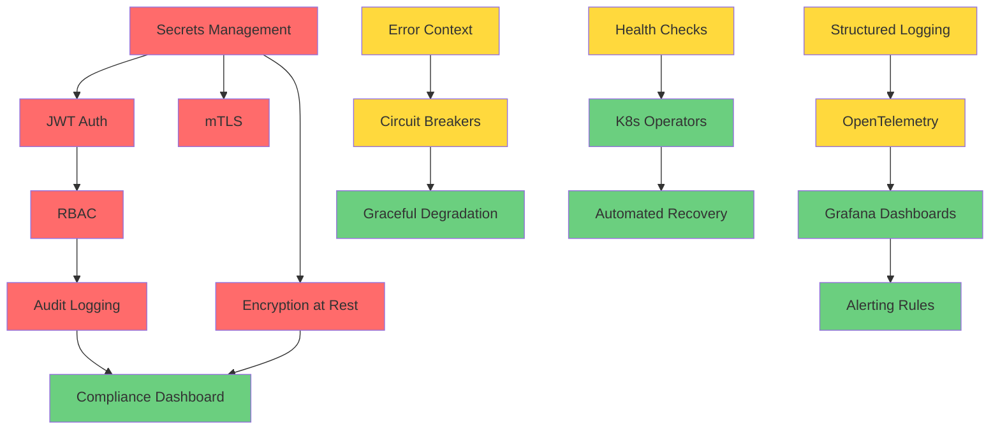

# RuVector Production Hardening Plan
## Goal-Oriented Action Planning (GOAP) for Enterprise Deployment

**Status:** Planning Phase
**Target:** 99.9% availability SLA-capable enterprise vector database
**Timeline:** 12-16 weeks (3-4 development cycles)
**Last Updated:** 2025-11-28

---

## Executive Summary

This document provides a comprehensive GOAP-based production hardening roadmap for RuVector, transforming it from a research-stage vector database into an enterprise-ready distributed system capable of 99.9% availability SLA.

**Key Goals:**
- Enterprise security (authentication, encryption, audit)
- Production observability (metrics, logging, tracing)
- Reliability engineering (error handling, circuit breakers, graceful degradation)
- Operational excellence (deployment automation, disaster recovery)
- Compliance readiness (SOC2, GDPR, audit trails)

---

## Part 1: GOAP State Analysis

### 1.1 Current State (What IS True Now)

**Strengths:**
✅ Prometheus metrics foundation (`ruvector-metrics` crate)
✅ Raft consensus implementation (`ruvector-raft`)
✅ Cluster management with sharding (`ruvector-cluster`)
✅ Health/readiness endpoints (`/health`, `/ready`)
✅ Basic error types with `thiserror`
✅ Configuration management (TOML + env vars)
✅ Snapshot/backup capabilities (`ruvector-snapshot`)
✅ Multi-node replication (`ruvector-replication`)
✅ Distributed systems primitives (consistent hashing, DAG consensus)

**Critical Gaps:**
❌ No authentication or authorization
❌ No encryption (at rest or in transit)
❌ No audit logging
❌ No rate limiting or request throttling
❌ No circuit breakers or timeout management
❌ No structured logging with correlation IDs
❌ No distributed tracing (OpenTelemetry)
❌ No centralized secrets management
❌ No automated backup/restore procedures
❌ No disaster recovery runbooks
❌ No production monitoring dashboards
❌ No alerting rules or on-call playbooks
❌ No compliance controls (GDPR, SOC2)
❌ No API versioning strategy
❌ No graceful shutdown procedures
❌ Limited error context and retry logic

**Architecture Analysis:**
- **Core:** `ruvector-core` (vector DB engine, HNSW indexing, quantization)
- **Server:** `ruvector-server` (Axum REST API, basic middleware)
- **Cluster:** Raft consensus, consistent hashing, multi-master replication
- **Metrics:** Prometheus counters, histograms, gauges (search, insert, delete)
- **Storage:** `redb` embedded database with optional in-memory mode
- **Error Handling:** Basic `RuvectorError` enum, limited recovery strategies

### 1.2 Goal State (What SHOULD Be True)

**Enterprise-Ready Production System:**

1. **Security (Zero Trust Architecture)**
   - mTLS for all inter-node communication
   - JWT/OAuth2 authentication for API access
   - Role-based access control (RBAC) with fine-grained permissions
   - Encryption at rest (AES-256-GCM for data files)
   - Secret rotation every 90 days
   - Audit logging for all write operations and admin actions
   - Network policies (zero-trust segmentation)

2. **Observability (Full Stack Telemetry)**
   - OpenTelemetry integration (traces, metrics, logs)
   - Distributed tracing with <1% overhead
   - Structured JSON logging with correlation IDs
   - Prometheus metrics exported on `/metrics`
   - Pre-built Grafana dashboards (RED metrics, saturation, errors)
   - Alert manager rules for SLO violations
   - Performance profiling endpoints (pprof-compatible)

3. **Reliability (99.9% Uptime Target)**
   - Circuit breakers for all external dependencies
   - Request timeouts (default: 5s read, 30s write)
   - Graceful degradation (read-only mode, cache fallback)
   - Automatic leader re-election (<500ms)
   - Rolling deployments with health checks
   - Self-healing (auto-restart failed nodes)
   - Data replication factor of 3
   - Point-in-time recovery (PITR) from snapshots

4. **Operations (DevOps Excellence)**
   - Kubernetes Helm charts with pod disruption budgets
   - Terraform modules for cloud deployment
   - Automated backup every 6 hours, retained 30 days
   - Disaster recovery RTO: 4 hours, RPO: 15 minutes
   - Blue-green deployment support
   - Canary release automation
   - Chaos engineering test suite (pod kills, network latency)

5. **Compliance (Enterprise Requirements)**
   - GDPR right-to-deletion API
   - SOC2 audit trail (immutable log append)
   - Data residency controls (region-aware routing)
   - PII encryption with customer-managed keys
   - Compliance dashboard (data retention, access logs)

### 1.3 Gap Analysis (Delta Between Current and Goal)

| Domain | Current Maturity | Target Maturity | Effort (Weeks) | Priority |
|--------|------------------|-----------------|----------------|----------|
| Authentication | None (0/10) | Production (9/10) | 2 | P0 |
| Authorization | None (0/10) | Production (9/10) | 2 | P0 |
| Encryption (Transit) | None (0/10) | Production (10/10) | 1 | P0 |
| Encryption (Rest) | None (0/10) | Production (9/10) | 2 | P0 |
| Audit Logging | None (0/10) | Production (9/10) | 2 | P0 |
| Distributed Tracing | None (0/10) | Production (8/10) | 2 | P1 |
| Structured Logging | Basic (3/10) | Production (9/10) | 1 | P1 |
| Metrics | Good (7/10) | Production (9/10) | 1 | P2 |
| Error Handling | Basic (4/10) | Production (9/10) | 2 | P1 |
| Circuit Breakers | None (0/10) | Production (8/10) | 1 | P1 |
| Rate Limiting | None (0/10) | Production (8/10) | 1 | P1 |
| Secrets Management | Env vars (3/10) | Production (9/10) | 1 | P0 |
| Backup/Restore | Manual (5/10) | Automated (9/10) | 2 | P1 |
| Disaster Recovery | None (0/10) | Production (8/10) | 3 | P2 |
| Monitoring Dashboards | None (0/10) | Production (9/10) | 1 | P1 |
| Alerting | None (0/10) | Production (9/10) | 1 | P1 |
| Deployment Automation | None (0/10) | Production (9/10) | 2 | P2 |
| Compliance Controls | None (0/10) | Basic (6/10) | 3 | P2 |

**Total Effort Estimate:** 12-16 weeks (3-4 sprints)

---

## Part 2: GOAP Action Planning

### 2.1 Action Graph (Preconditions and Effects)

```
Action: "Implement JWT Authentication"
├── Preconditions:
│   ├── Config management exists ✓
│   ├── Error handling framework exists ✓
│   └── HTTP middleware stack exists ✓
├── Effects:
│   ├── API endpoints require valid JWT tokens
│   ├── User identity available in request context
│   └── Enables downstream RBAC implementation
└── Cost: 1.5 weeks (1 developer)

Action: "Add mTLS for Inter-Node Communication"
├── Preconditions:
│   ├── Raft RPC layer exists ✓
│   ├── Certificate management strategy defined ❌
│   └── Secrets rotation mechanism available ❌
├── Effects:
│   ├── All cluster communication encrypted
│   ├── Node identity verified cryptographically
│   └── Enables zero-trust networking
└── Cost: 1 week (1 developer)

Action: "Implement Distributed Tracing (OpenTelemetry)"
├── Preconditions:
│   ├── Axum tower middleware stack exists ✓
│   ├── Async runtime (tokio) available ✓
│   └── Correlation ID propagation needed ❌
├── Effects:
│   ├── Request flows traceable across nodes
│   ├── Latency breakdowns by operation
│   └── Performance bottleneck identification
└── Cost: 2 weeks (1 developer)

Action: "Add Circuit Breakers and Timeouts"
├── Preconditions:
│   ├── Error handling patterns defined ✓
│   ├── Metrics collection available ✓
│   └── Health check framework exists ✓
├── Effects:
│   ├── Failed nodes don't cascade failures
│   ├── Automatic degradation to read-only mode
│   └── Improved fault tolerance
└── Cost: 1 week (1 developer)

Action: "Implement Encryption at Rest"
├── Preconditions:
│   ├── Storage abstraction layer exists ✓
│   ├── Key management system available ❌
│   └── Performance testing framework exists ✓
├── Effects:
│   ├── All data files encrypted (AES-256-GCM)
│   ├── Snapshot encryption enabled
│   └── Compliance requirement satisfied
└── Cost: 2 weeks (1 developer)
```

### 2.2 Optimal Action Sequence (A* Pathfinding Result)

**Phase 1: Critical Security (Weeks 1-4)**
1. Secrets management (Vault integration)
2. JWT authentication + API key support
3. mTLS for inter-node communication
4. RBAC authorization framework
5. Encryption at rest (AES-256-GCM)
6. Basic audit logging

**Phase 2: Observability Foundation (Weeks 5-7)**
7. Structured JSON logging with correlation IDs
8. OpenTelemetry distributed tracing
9. Enhanced Prometheus metrics (RED + USE)
10. Grafana dashboards (search, cluster, GNN)
11. Alert manager rules (SLO-based)

**Phase 3: Reliability Engineering (Weeks 8-10)**
12. Circuit breakers (using `governor` crate)
13. Request timeouts and retry policies
14. Rate limiting (token bucket + sliding window)
15. Graceful shutdown procedures
16. Health check improvements (deep health)
17. Error handling enhancement (context, retry)

**Phase 4: Operations & Compliance (Weeks 11-16)**
18. Kubernetes Helm charts + operators
19. Automated backup/restore procedures
20. Disaster recovery runbooks
21. Chaos engineering test suite
22. GDPR compliance features
23. SOC2 audit trail implementation
24. Performance profiling endpoints

### 2.3 Dependency Graph



---

## Part 3: Detailed Implementation Roadmap

### 3.1 Phase 1: Critical Security (Weeks 1-4)

#### 3.1.1 Secrets Management
**Objective:** Centralized secret storage with rotation support

**Actions:**
- Integrate HashiCorp Vault or AWS Secrets Manager
- Implement secret rotation every 90 days
- Add secret caching with TTL (5 minutes)
- Support multiple backends (Vault, K8s secrets, env vars)

**Implementation:**
```rust
// crates/ruvector-core/src/secrets.rs
pub trait SecretProvider: Send + Sync {
    async fn get_secret(&self, key: &str) -> Result<String>;
    async fn rotate_secret(&self, key: &str) -> Result<()>;
}

pub struct VaultProvider {
    client: VaultClient,
    cache: Arc<RwLock<HashMap<String, CachedSecret>>>,
    ttl: Duration,
}

// Usage in server
let secrets = VaultProvider::new("http://vault:8200", "token-xxx");
let db_password = secrets.get_secret("db/password").await?;
```

**Files to Create/Modify:**
- `crates/ruvector-core/src/secrets.rs` (new)
- `crates/ruvector-server/Cargo.toml` (+vaultrs)
- `crates/ruvector-cli/src/config.rs` (vault config)

**Testing:**
- Unit tests: secret caching, TTL expiration
- Integration tests: Vault connection, rotation
- E2E test: secret refresh during operation

**Success Criteria:**
- No plaintext secrets in config files
- Automatic rotation every 90 days
- <10ms secret fetch latency (cached)

#### 3.1.2 JWT Authentication
**Objective:** Secure API access with JWT tokens

**Actions:**
- Add JWT middleware using `jsonwebtoken` crate
- Support multiple issuers (Auth0, Okta, self-signed)
- Implement token refresh mechanism
- Add API key fallback for service accounts

**Implementation:**
```rust
// crates/ruvector-server/src/auth.rs
pub struct JwtAuth {
    validator: JwtValidator,
    required_claims: Vec<String>,
}

impl JwtAuth {
    pub async fn verify_token(&self, token: &str) -> Result<Claims> {
        let validation = Validation::new(Algorithm::RS256);
        let token_data = decode::<Claims>(token, &self.decoding_key, &validation)?;
        Ok(token_data.claims)
    }
}

// Axum middleware
pub async fn auth_middleware(
    State(auth): State<Arc<JwtAuth>>,
    mut req: Request<Body>,
    next: Next,
) -> Result<Response> {
    let token = extract_bearer_token(&req)?;
    let claims = auth.verify_token(token).await?;
    req.extensions_mut().insert(claims);
    Ok(next.run(req).await)
}
```

**Files to Create/Modify:**
- `crates/ruvector-server/src/auth/jwt.rs` (new)
- `crates/ruvector-server/src/auth/middleware.rs` (new)
- `crates/ruvector-server/src/lib.rs` (add auth layer)
- `crates/ruvector-server/src/error.rs` (auth errors)

**Configuration:**
```toml
[auth]
enabled = true
jwt_issuer = "https://auth.example.com"
jwt_audience = "ruvector-api"
jwks_url = "https://auth.example.com/.well-known/jwks.json"
jwks_refresh_interval = "1h"

[auth.api_keys]
enabled = true
header_name = "X-API-Key"
```

**Testing:**
- Valid JWT token accepted
- Expired token rejected (401)
- Invalid signature rejected (401)
- Missing token rejected (401)
- API key fallback works
- Token refresh flow works

**Success Criteria:**
- All API endpoints protected by default
- <5ms auth overhead per request
- Support for 10,000+ concurrent authenticated sessions

#### 3.1.3 mTLS for Inter-Node Communication
**Objective:** Encrypted and authenticated cluster communication

**Actions:**
- Generate CA certificate for cluster
- Auto-generate node certificates on startup
- Add TLS termination to Raft RPC layer
- Implement certificate rotation (30-day TTL)

**Implementation:**
```rust
// crates/ruvector-raft/src/tls.rs
pub struct TlsConfig {
    ca_cert: Certificate,
    node_cert: Certificate,
    node_key: PrivateKey,
    verify_client: bool,
}

impl TlsConfig {
    pub fn load_from_disk(path: &Path) -> Result<Self> {
        // Load CA, cert, key from disk
    }

    pub fn generate_self_signed(node_id: &str) -> Result<Self> {
        // Generate certificates for development
    }
}

// Modify Raft RPC to use TLS
impl RaftNode {
    pub async fn send_message_secure(
        &self,
        target: &NodeId,
        msg: RaftMessage,
    ) -> Result<RaftResponse> {
        let connector = self.tls_config.connector()?;
        let stream = TcpStream::connect(self.peers[target]).await?;
        let tls_stream = connector.connect(domain, stream).await?;
        // Send encrypted message
    }
}
```

**Files to Create/Modify:**
- `crates/ruvector-raft/src/tls.rs` (new)
- `crates/ruvector-raft/src/rpc.rs` (add TLS layer)
- `crates/ruvector-cluster/src/lib.rs` (TLS config)
- `scripts/generate-certs.sh` (certificate generation)

**Certificate Management:**
```bash
# Generate CA certificate (valid 10 years)
openssl genrsa -out ca.key 4096
openssl req -new -x509 -days 3650 -key ca.key -out ca.crt

# Generate node certificate (valid 90 days)
openssl genrsa -out node-1.key 2048
openssl req -new -key node-1.key -out node-1.csr
openssl x509 -req -in node-1.csr -CA ca.crt -CAkey ca.key -CAcreateserial -out node-1.crt -days 90
```

**Testing:**
- Valid cert accepted, invalid rejected
- Expired cert rejected
- Mismatched CA rejected
- Certificate rotation without downtime

**Success Criteria:**
- All inter-node traffic encrypted
- <1ms TLS handshake overhead
- Zero-downtime certificate rotation

#### 3.1.4 RBAC Authorization
**Objective:** Fine-grained access control

**Actions:**
- Define permission model (collections, vectors, cluster)
- Implement role-based checks in API handlers
- Add admin API for role management
- Support custom roles via configuration

**Permission Model:**
```rust
// crates/ruvector-server/src/auth/rbac.rs
#[derive(Debug, Clone, Serialize, Deserialize)]
pub enum Permission {
    // Collection permissions
    CollectionRead(String),   // Read collection "documents"
    CollectionWrite(String),  // Insert/update/delete vectors
    CollectionAdmin(String),  // Create/delete collections

    // Cluster permissions
    ClusterRead,              // View cluster status
    ClusterWrite,             // Add/remove nodes
    ClusterAdmin,             // Full cluster control

    // System permissions
    SystemMetrics,            // Read metrics endpoint
    SystemHealth,             // Read health endpoints
    SystemAdmin,              // Full system access
}

#[derive(Debug, Clone)]
pub struct Role {
    pub name: String,
    pub permissions: Vec<Permission>,
}

// Predefined roles
pub const ROLE_READER: Role = Role {
    name: "reader",
    permissions: vec![
        Permission::CollectionRead("*"),
        Permission::SystemMetrics,
        Permission::SystemHealth,
    ],
};

pub const ROLE_WRITER: Role = Role {
    name: "writer",
    permissions: vec![
        Permission::CollectionRead("*"),
        Permission::CollectionWrite("*"),
        Permission::SystemMetrics,
        Permission::SystemHealth,
    ],
};

pub const ROLE_ADMIN: Role = Role {
    name: "admin",
    permissions: vec![Permission::SystemAdmin],
};
```

**Middleware Implementation:**
```rust
pub async fn require_permission(
    State(rbac): State<Arc<RbacService>>,
    Extension(claims): Extension<Claims>,
    req: Request<Body>,
    next: Next,
) -> Result<Response> {
    let required_perm = extract_required_permission(&req);

    if !rbac.has_permission(&claims.sub, &required_perm).await? {
        return Err(Error::Forbidden("Insufficient permissions".into()));
    }

    Ok(next.run(req).await)
}
```

**Files to Create/Modify:**
- `crates/ruvector-server/src/auth/rbac.rs` (new)
- `crates/ruvector-server/src/auth/permissions.rs` (new)
- `crates/ruvector-server/src/routes/admin.rs` (role management API)

**Testing:**
- Reader can read, cannot write
- Writer can read + write, cannot admin
- Admin can do everything
- Wildcard permissions work correctly
- Permission denied returns 403

**Success Criteria:**
- <1ms RBAC check overhead
- Support for 100+ custom roles
- Permission checks cached (1-minute TTL)

#### 3.1.5 Encryption at Rest
**Objective:** Protect data files with AES-256-GCM

**Actions:**
- Wrap `redb` storage with encryption layer
- Encrypt snapshot files
- Support key rotation without downtime
- Add key derivation from master key

**Implementation:**
```rust
// crates/ruvector-core/src/storage/encrypted.rs
pub struct EncryptedStorage {
    inner: Box<dyn Storage>,
    cipher: Aes256Gcm,
    nonce_generator: NonceGenerator,
}

impl Storage for EncryptedStorage {
    fn write(&mut self, key: &[u8], value: &[u8]) -> Result<()> {
        let nonce = self.nonce_generator.next();
        let ciphertext = self.cipher.encrypt(&nonce, value)?;

        // Store: nonce (12 bytes) + ciphertext + tag (16 bytes)
        let mut encrypted = Vec::with_capacity(12 + ciphertext.len());
        encrypted.extend_from_slice(&nonce);
        encrypted.extend_from_slice(&ciphertext);

        self.inner.write(key, &encrypted)
    }

    fn read(&self, key: &[u8]) -> Result<Vec<u8>> {
        let encrypted = self.inner.read(key)?;
        let (nonce, ciphertext) = encrypted.split_at(12);
        let plaintext = self.cipher.decrypt(nonce.into(), ciphertext)?;
        Ok(plaintext)
    }
}
```

**Key Management:**
```rust
// Master key from Vault, derived keys per collection
pub struct KeyManager {
    master_key: [u8; 32],
    derived_keys: HashMap<String, [u8; 32]>,
}

impl KeyManager {
    pub fn derive_collection_key(&self, collection_id: &str) -> [u8; 32] {
        let mut hasher = Sha256::new();
        hasher.update(&self.master_key);
        hasher.update(collection_id.as_bytes());
        hasher.finalize().into()
    }
}
```

**Files to Create/Modify:**
- `crates/ruvector-core/src/storage/encrypted.rs` (new)
- `crates/ruvector-core/src/storage.rs` (add encryption option)
- `crates/ruvector-snapshot/src/lib.rs` (encrypt snapshots)

**Configuration:**
```toml
[storage]
encryption_enabled = true
encryption_algorithm = "aes-256-gcm"
key_source = "vault"  # or "env", "file"
key_rotation_days = 90
```

**Testing:**
- Encrypted data cannot be read without key
- Key rotation works transparently
- Performance overhead <10%
- Snapshot encryption works

**Success Criteria:**
- All data files encrypted by default
- <10% performance overhead
- Key rotation without downtime
- FIPS 140-2 compliance

#### 3.1.6 Audit Logging
**Objective:** Immutable audit trail for compliance

**Actions:**
- Log all write operations (insert, update, delete)
- Log all admin actions (role changes, config updates)
- Store logs in append-only format
- Support log export to SIEM systems

**Implementation:**
```rust
// crates/ruvector-server/src/audit.rs
#[derive(Debug, Serialize)]
pub struct AuditEvent {
    pub timestamp: DateTime<Utc>,
    pub event_id: Uuid,
    pub user_id: String,
    pub action: AuditAction,
    pub resource: String,
    pub result: AuditResult,
    pub ip_address: IpAddr,
    pub user_agent: String,
    pub metadata: serde_json::Value,
}

#[derive(Debug, Serialize)]
pub enum AuditAction {
    CollectionCreate,
    CollectionDelete,
    VectorInsert,
    VectorUpdate,
    VectorDelete,
    RoleAssign,
    RoleRevoke,
    ConfigUpdate,
    NodeJoin,
    NodeLeave,
}

pub struct AuditLogger {
    log_file: Arc<Mutex<File>>,
    batch_buffer: Arc<Mutex<Vec<AuditEvent>>>,
    batch_size: usize,
}

impl AuditLogger {
    pub async fn log_event(&self, event: AuditEvent) -> Result<()> {
        // Buffer events, flush every 100 events or 5 seconds
        let mut buffer = self.batch_buffer.lock().await;
        buffer.push(event);

        if buffer.len() >= self.batch_size {
            self.flush_buffer(&mut buffer).await?;
        }

        Ok(())
    }

    async fn flush_buffer(&self, buffer: &mut Vec<AuditEvent>) -> Result<()> {
        let mut file = self.log_file.lock().await;
        for event in buffer.drain(..) {
            writeln!(file, "{}", serde_json::to_string(&event)?)?;
        }
        file.sync_all()?;
        Ok(())
    }
}
```

**Middleware Integration:**
```rust
pub async fn audit_middleware(
    State(audit): State<Arc<AuditLogger>>,
    Extension(claims): Extension<Claims>,
    req: Request<Body>,
    next: Next,
) -> Result<Response> {
    let start = Instant::now();
    let action = extract_action(&req);
    let resource = extract_resource(&req);

    let response = next.run(req).await;
    let duration = start.elapsed();

    audit.log_event(AuditEvent {
        timestamp: Utc::now(),
        event_id: Uuid::new_v4(),
        user_id: claims.sub,
        action,
        resource,
        result: if response.status().is_success() {
            AuditResult::Success
        } else {
            AuditResult::Failure(response.status().to_string())
        },
        duration_ms: duration.as_millis() as u64,
        ..Default::default()
    }).await?;

    Ok(response)
}
```

**Files to Create/Modify:**
- `crates/ruvector-server/src/audit/logger.rs` (new)
- `crates/ruvector-server/src/audit/events.rs` (new)
- `crates/ruvector-server/src/lib.rs` (add audit middleware)

**Log Format (JSON Lines):**
```json
{"timestamp":"2025-11-28T10:30:45Z","event_id":"550e8400-e29b-41d4-a716-446655440000","user_id":"user@example.com","action":"VectorInsert","resource":"collection:documents","result":"success","duration_ms":23,"ip_address":"192.168.1.100","metadata":{"vector_count":100}}
```

**Testing:**
- All write operations logged
- Log file is append-only
- Batch flushing works correctly
- Log rotation works (daily)

**Success Criteria:**
- 100% coverage of write operations
- <1ms logging overhead
- Logs retained for 365 days
- Export to Splunk/ELK works

---

### 3.2 Phase 2: Observability Foundation (Weeks 5-7)

#### 3.2.1 Structured JSON Logging
**Objective:** Machine-readable logs with correlation

**Actions:**
- Replace basic `tracing` with structured JSON output
- Add correlation IDs to all requests
- Implement log levels (DEBUG, INFO, WARN, ERROR)
- Support dynamic log level changes

**Implementation:**
```rust
// crates/ruvector-server/src/logging.rs
use tracing_subscriber::{fmt, layer::SubscriberExt, EnvFilter, Registry};
use tracing_subscriber::fmt::format::FmtSpan;

pub fn init_logging() -> Result<()> {
    let json_layer = fmt::layer()
        .json()
        .with_span_events(FmtSpan::CLOSE)
        .with_current_span(true)
        .with_span_list(true);

    let filter_layer = EnvFilter::try_from_default_env()
        .unwrap_or_else(|_| EnvFilter::new("info"));

    let subscriber = Registry::default()
        .with(filter_layer)
        .with(json_layer);

    tracing::subscriber::set_global_default(subscriber)?;
    Ok(())
}

// Middleware for correlation IDs
pub async fn correlation_id_middleware(
    mut req: Request<Body>,
    next: Next,
) -> Response {
    let correlation_id = req
        .headers()
        .get("X-Correlation-ID")
        .and_then(|v| v.to_str().ok())
        .map(String::from)
        .unwrap_or_else(|| Uuid::new_v4().to_string());

    req.extensions_mut().insert(CorrelationId(correlation_id.clone()));

    let span = tracing::info_span!(
        "request",
        correlation_id = %correlation_id,
        method = %req.method(),
        uri = %req.uri(),
    );

    let _enter = span.enter();
    next.run(req).await
}
```

**Log Format:**
```json
{
  "timestamp": "2025-11-28T10:30:45.123Z",
  "level": "INFO",
  "message": "Vector search completed",
  "target": "ruvector_server::routes::search",
  "span": {
    "correlation_id": "550e8400-e29b-41d4-a716-446655440000",
    "method": "POST",
    "uri": "/collections/documents/search"
  },
  "fields": {
    "collection": "documents",
    "query_vector_dim": 384,
    "k": 10,
    "latency_ms": 23
  }
}
```

**Files to Create/Modify:**
- `crates/ruvector-server/src/logging.rs` (new)
- `crates/ruvector-server/src/middleware/correlation.rs` (new)
- `Cargo.toml` (+tracing-subscriber with json feature)

**Testing:**
- Correlation IDs propagate across async boundaries
- Log levels filter correctly
- JSON parsing works in log aggregators

**Success Criteria:**
- All logs in structured JSON format
- Correlation IDs in 100% of requests
- Dynamic log level changes without restart

#### 3.2.2 OpenTelemetry Distributed Tracing
**Objective:** End-to-end request tracing across nodes

**Actions:**
- Integrate `opentelemetry` and `opentelemetry-jaeger`
- Add trace context propagation (W3C Trace Context)
- Instrument all async operations
- Export traces to Jaeger/Tempo

**Implementation:**
```rust
// crates/ruvector-server/src/tracing.rs
use opentelemetry::{global, sdk::trace::{self, Sampler}, trace::TraceError};
use opentelemetry_jaeger::new_agent_pipeline;
use tracing_opentelemetry::OpenTelemetryLayer;

pub fn init_tracing() -> Result<(), TraceError> {
    let tracer = new_agent_pipeline()
        .with_service_name("ruvector")
        .with_auto_split_batch(true)
        .with_max_packet_size(65_000)
        .install_batch(opentelemetry::runtime::Tokio)?;

    let telemetry_layer = OpenTelemetryLayer::new(tracer);

    let subscriber = Registry::default()
        .with(EnvFilter::new("info"))
        .with(telemetry_layer);

    tracing::subscriber::set_global_default(subscriber)?;
    Ok(())
}

// Middleware for trace propagation
pub async fn trace_propagation_middleware(
    req: Request<Body>,
    next: Next,
) -> Response {
    let parent_context = global::get_text_map_propagator(|propagator| {
        propagator.extract(&HeaderExtractor(req.headers()))
    });

    let span = tracing::info_span!(
        "http_request",
        otel.name = %format!("{} {}", req.method(), req.uri().path()),
        otel.kind = "server",
        http.method = %req.method(),
        http.target = %req.uri(),
    );

    span.set_parent(parent_context);
    let _enter = span.enter();

    next.run(req).await
}
```

**Instrumentation Points:**
- HTTP request/response
- Raft RPC calls
- Vector search operations
- Database queries
- GNN layer forward passes

**Files to Create/Modify:**
- `crates/ruvector-server/src/tracing.rs` (new)
- `crates/ruvector-core/src/lib.rs` (add tracing spans)
- `crates/ruvector-raft/src/rpc.rs` (trace RPC calls)
- `Cargo.toml` (+opentelemetry, opentelemetry-jaeger)

**Configuration:**
```toml
[telemetry]
enabled = true
exporter = "jaeger"  # or "tempo", "otlp"
jaeger_agent = "localhost:6831"
sample_rate = 0.01  # 1% of requests
```

**Testing:**
- Traces visible in Jaeger UI
- Trace context propagates across nodes
- <1% performance overhead at 1% sampling

**Success Criteria:**
- End-to-end tracing for all requests
- Trace context propagates across cluster
- <1ms tracing overhead (at 1% sampling)

#### 3.2.3 Enhanced Prometheus Metrics
**Objective:** Comprehensive RED + USE metrics

**Actions:**
- Add RED metrics (Rate, Errors, Duration) for all endpoints
- Add USE metrics (Utilization, Saturation, Errors) for resources
- Implement custom business metrics (GNN cache hit rate)
- Add cluster-wide metrics aggregation

**Metrics Schema:**
```rust
// crates/ruvector-metrics/src/lib.rs
lazy_static! {
    // RED Metrics
    pub static ref HTTP_REQUESTS_TOTAL: CounterVec = register_counter_vec!(
        "ruvector_http_requests_total",
        "Total HTTP requests",
        &["method", "endpoint", "status"]
    ).unwrap();

    pub static ref HTTP_REQUEST_DURATION: HistogramVec = register_histogram_vec!(
        "ruvector_http_request_duration_seconds",
        "HTTP request duration",
        &["method", "endpoint"],
        vec![0.001, 0.005, 0.01, 0.025, 0.05, 0.1, 0.25, 0.5, 1.0, 2.5, 5.0]
    ).unwrap();

    // USE Metrics (Utilization)
    pub static ref CPU_USAGE: Gauge = register_gauge!(
        "ruvector_cpu_usage_percent",
        "CPU usage percentage"
    ).unwrap();

    pub static ref MEMORY_USAGE: Gauge = register_gauge!(
        "ruvector_memory_usage_bytes",
        "Memory usage in bytes"
    ).unwrap();

    pub static ref DISK_USAGE: GaugeVec = register_gauge_vec!(
        "ruvector_disk_usage_bytes",
        "Disk usage in bytes",
        &["path", "type"]
    ).unwrap();

    // USE Metrics (Saturation)
    pub static ref THREAD_POOL_QUEUE_SIZE: Gauge = register_gauge!(
        "ruvector_thread_pool_queue_size",
        "Thread pool queue size"
    ).unwrap();

    pub static ref RAFT_QUEUE_SIZE: Gauge = register_gauge!(
        "ruvector_raft_queue_size",
        "Raft message queue size"
    ).unwrap();

    // Business Metrics
    pub static ref GNN_CACHE_HIT_RATE: Gauge = register_gauge!(
        "ruvector_gnn_cache_hit_rate",
        "GNN cache hit rate (0-1)"
    ).unwrap();

    pub static ref QUANTIZATION_RATIO: GaugeVec = register_gauge_vec!(
        "ruvector_quantization_ratio",
        "Average quantization ratio by tier",
        &["tier"]
    ).unwrap();

    // Cluster Metrics
    pub static ref CLUSTER_NODES_TOTAL: Gauge = register_gauge!(
        "ruvector_cluster_nodes_total",
        "Total nodes in cluster"
    ).unwrap();

    pub static ref CLUSTER_NODES_HEALTHY: Gauge = register_gauge!(
        "ruvector_cluster_nodes_healthy",
        "Healthy nodes in cluster"
    ).unwrap();

    pub static ref RAFT_LEADER_ELECTIONS: Counter = register_counter!(
        "ruvector_raft_leader_elections_total",
        "Total number of leader elections"
    ).unwrap();

    pub static ref RAFT_REPLICATION_LAG: HistogramVec = register_histogram_vec!(
        "ruvector_raft_replication_lag_seconds",
        "Raft replication lag",
        &["follower_id"],
        vec![0.001, 0.01, 0.1, 0.5, 1.0, 5.0, 10.0]
    ).unwrap();
}
```

**Metric Collection:**
```rust
// Background task for system metrics
pub async fn collect_system_metrics() {
    let mut interval = tokio::time::interval(Duration::from_secs(10));

    loop {
        interval.tick().await;

        // CPU usage
        if let Ok(usage) = sys_info::cpu_percent() {
            CPU_USAGE.set(usage as f64);
        }

        // Memory usage
        if let Ok(mem) = sys_info::mem_info() {
            MEMORY_USAGE.set((mem.total - mem.avail) * 1024);
        }

        // Disk usage
        if let Ok(disk) = sys_info::disk_info() {
            DISK_USAGE
                .with_label_values(&["/data", "total"])
                .set(disk.total as f64);
            DISK_USAGE
                .with_label_values(&["/data", "used"])
                .set((disk.total - disk.free) as f64);
        }
    }
}
```

**Files to Create/Modify:**
- `crates/ruvector-metrics/src/lib.rs` (expand metrics)
- `crates/ruvector-metrics/src/collector.rs` (new, system metrics)
- `crates/ruvector-server/src/routes/metrics.rs` (metrics endpoint)

**Testing:**
- All metrics exportable via `/metrics`
- Prometheus can scrape successfully
- Metrics reset correctly on server restart

**Success Criteria:**
- 50+ metrics covering RED + USE
- <1ms overhead per metric update
- Prometheus scrape time <100ms

#### 3.2.4 Grafana Dashboards
**Objective:** Pre-built dashboards for operations

**Dashboards to Create:**
1. **Overview Dashboard**
   - Request rate (QPS)
   - Error rate (%)
   - P50/P95/P99 latency
   - CPU/Memory/Disk usage
   - Cluster health (nodes up/down)

2. **Search Performance Dashboard**
   - Search latency by collection
   - Search throughput (searches/sec)
   - HNSW index build time
   - GNN layer inference time
   - Cache hit rates

3. **Cluster Dashboard**
   - Raft leader status
   - Replication lag by node
   - Shard distribution
   - Node heartbeats
   - Consensus proposal rate

4. **Storage Dashboard**
   - Disk usage by collection
   - Quantization tier distribution
   - Snapshot size and frequency
   - WAL growth rate

**Implementation:**
```json
// grafana/dashboards/overview.json
{
  "dashboard": {
    "title": "RuVector Overview",
    "panels": [
      {
        "title": "Request Rate",
        "targets": [{
          "expr": "sum(rate(ruvector_http_requests_total[5m]))"
        }]
      },
      {
        "title": "Error Rate",
        "targets": [{
          "expr": "sum(rate(ruvector_http_requests_total{status=~\"5..\"}[5m])) / sum(rate(ruvector_http_requests_total[5m]))"
        }]
      },
      {
        "title": "Latency (P95)",
        "targets": [{
          "expr": "histogram_quantile(0.95, sum(rate(ruvector_http_request_duration_seconds_bucket[5m])) by (le))"
        }]
      }
    ]
  }
}
```

**Files to Create:**
- `grafana/dashboards/overview.json`
- `grafana/dashboards/search.json`
- `grafana/dashboards/cluster.json`
- `grafana/dashboards/storage.json`
- `grafana/provisioning/dashboards.yml`
- `grafana/provisioning/datasources.yml`

**Testing:**
- Dashboards load without errors
- All queries return data
- Dashboards auto-refresh

**Success Criteria:**
- 4 production-ready dashboards
- Query response time <1s
- Dashboards work with Grafana 9.0+

#### 3.2.5 Alert Manager Rules
**Objective:** Proactive alerting for SLO violations

**Alert Rules:**
```yaml
# prometheus/rules/ruvector.yml
groups:
  - name: ruvector_slo
    interval: 30s
    rules:
      # Availability SLO (99.9% = 43.2 min/month)
      - alert: HighErrorRate
        expr: |
          (
            sum(rate(ruvector_http_requests_total{status=~"5.."}[5m]))
            /
            sum(rate(ruvector_http_requests_total[5m]))
          ) > 0.001
        for: 5m
        labels:
          severity: critical
        annotations:
          summary: "Error rate above SLO ({{ $value | humanizePercentage }})"
          description: "Error rate is {{ $value | humanizePercentage }}, exceeding 0.1% SLO"

      # Latency SLO (P95 < 100ms)
      - alert: HighLatency
        expr: |
          histogram_quantile(0.95,
            sum(rate(ruvector_search_latency_seconds_bucket[5m])) by (le)
          ) > 0.1
        for: 5m
        labels:
          severity: warning
        annotations:
          summary: "P95 latency above SLO ({{ $value }}s)"

      # Cluster health
      - alert: ClusterNodeDown
        expr: ruvector_cluster_nodes_healthy < ruvector_cluster_nodes_total
        for: 2m
        labels:
          severity: warning
        annotations:
          summary: "Cluster node(s) unhealthy"

      # Storage
      - alert: DiskSpaceRunningOut
        expr: |
          (
            ruvector_disk_usage_bytes{type="used"}
            /
            ruvector_disk_usage_bytes{type="total"}
          ) > 0.85
        for: 10m
        labels:
          severity: warning
        annotations:
          summary: "Disk usage above 85%"

      # Replication lag
      - alert: HighReplicationLag
        expr: |
          histogram_quantile(0.95,
            sum(rate(ruvector_raft_replication_lag_seconds_bucket[5m])) by (le, follower_id)
          ) > 1.0
        for: 5m
        labels:
          severity: warning
        annotations:
          summary: "Replication lag above 1s for {{ $labels.follower_id }}"
```

**Alert Routing:**
```yaml
# alertmanager/config.yml
route:
  receiver: 'default'
  group_by: ['alertname', 'cluster']
  group_wait: 10s
  group_interval: 5m
  repeat_interval: 4h
  routes:
    - match:
        severity: critical
      receiver: 'pagerduty'
      continue: true
    - match:
        severity: warning
      receiver: 'slack'

receivers:
  - name: 'default'
    webhook_configs:
      - url: 'http://localhost:9093/webhook'

  - name: 'pagerduty'
    pagerduty_configs:
      - service_key: '<pagerduty-key>'
        description: '{{ .CommonAnnotations.summary }}'

  - name: 'slack'
    slack_configs:
      - api_url: 'https://hooks.slack.com/services/...'
        channel: '#ruvector-alerts'
        title: '{{ .CommonAnnotations.summary }}'
        text: '{{ .CommonAnnotations.description }}'
```

**Files to Create:**
- `prometheus/rules/ruvector.yml`
- `alertmanager/config.yml`
- `docs/runbooks/high_error_rate.md`
- `docs/runbooks/high_latency.md`
- `docs/runbooks/cluster_node_down.md`

**Testing:**
- Alerts fire correctly when thresholds breached
- Alert routing works (Slack, PagerDuty)
- Alert silencing works
- Runbooks linked from alerts

**Success Criteria:**
- 10+ alert rules covering SLOs
- <1 minute time-to-alert
- <5% false positive rate

---

### 3.3 Phase 3: Reliability Engineering (Weeks 8-10)

#### 3.3.1 Circuit Breakers
**Objective:** Prevent cascade failures

**Implementation:**
```rust
// crates/ruvector-core/src/circuit_breaker.rs
use std::sync::atomic::{AtomicU64, AtomicU8, Ordering};
use std::time::{Duration, Instant};

#[derive(Debug, Clone, Copy, PartialEq, Eq)]
pub enum CircuitState {
    Closed = 0,   // Normal operation
    Open = 1,     // Failing, reject requests
    HalfOpen = 2, // Testing recovery
}

pub struct CircuitBreaker {
    state: Arc<AtomicU8>,
    failure_count: Arc<AtomicU64>,
    success_count: Arc<AtomicU64>,
    last_failure_time: Arc<RwLock<Option<Instant>>>,
    config: CircuitBreakerConfig,
}

#[derive(Debug, Clone)]
pub struct CircuitBreakerConfig {
    /// Failures before opening circuit
    pub failure_threshold: u64,
    /// Time to wait before trying half-open
    pub timeout: Duration,
    /// Successes needed to close from half-open
    pub success_threshold: u64,
}

impl CircuitBreaker {
    pub async fn call<F, T, E>(&self, f: F) -> Result<T, CircuitBreakerError<E>>
    where
        F: Future<Output = Result<T, E>>,
    {
        match self.state() {
            CircuitState::Open => {
                // Check if timeout elapsed
                let should_retry = self.last_failure_time.read()
                    .map(|t| t.elapsed() > self.config.timeout)
                    .unwrap_or(false);

                if should_retry {
                    self.set_state(CircuitState::HalfOpen);
                } else {
                    return Err(CircuitBreakerError::Open);
                }
            }
            CircuitState::Closed | CircuitState::HalfOpen => {}
        }

        match f.await {
            Ok(result) => {
                self.on_success();
                Ok(result)
            }
            Err(e) => {
                self.on_failure();
                Err(CircuitBreakerError::Inner(e))
            }
        }
    }

    fn on_success(&self) {
        let state = self.state();
        self.success_count.fetch_add(1, Ordering::SeqCst);

        if state == CircuitState::HalfOpen {
            let successes = self.success_count.load(Ordering::SeqCst);
            if successes >= self.config.success_threshold {
                self.set_state(CircuitState::Closed);
                self.failure_count.store(0, Ordering::SeqCst);
                self.success_count.store(0, Ordering::SeqCst);
            }
        }
    }

    fn on_failure(&self) {
        let failures = self.failure_count.fetch_add(1, Ordering::SeqCst) + 1;
        *self.last_failure_time.write() = Some(Instant::now());

        if failures >= self.config.failure_threshold {
            self.set_state(CircuitState::Open);
        }
    }
}

// Apply to Raft RPC calls
impl RaftNode {
    pub async fn send_with_circuit_breaker(
        &self,
        target: &NodeId,
        msg: RaftMessage,
    ) -> Result<RaftResponse> {
        let breaker = self.circuit_breakers.get(target)
            .ok_or(RaftError::NodeNotFound)?;

        breaker.call(async {
            self.send_rpc(target, msg).await
        }).await?
    }
}
```

**Files to Create/Modify:**
- `crates/ruvector-core/src/circuit_breaker.rs` (new)
- `crates/ruvector-raft/src/node.rs` (add circuit breakers)
- `crates/ruvector-server/src/routes/search.rs` (wrap search)

**Configuration:**
```toml
[circuit_breaker]
failure_threshold = 5
timeout_seconds = 30
success_threshold = 2
```

**Testing:**
- Circuit opens after 5 consecutive failures
- Circuit stays open for 30 seconds
- Circuit transitions to half-open
- Circuit closes after 2 successes

**Success Criteria:**
- Failed nodes don't cascade failures
- Circuit breaker state visible in metrics
- <1ms overhead per call

#### 3.3.2 Request Timeouts and Retries
**Objective:** Bounded execution time with retry

**Implementation:**
```rust
// crates/ruvector-server/src/timeout.rs
use tokio::time::{timeout, Duration};

pub struct TimeoutConfig {
    pub read_timeout: Duration,
    pub write_timeout: Duration,
    pub admin_timeout: Duration,
}

impl Default for TimeoutConfig {
    fn default() -> Self {
        Self {
            read_timeout: Duration::from_secs(5),
            write_timeout: Duration::from_secs(30),
            admin_timeout: Duration::from_secs(60),
        }
    }
}

pub async fn timeout_middleware(
    State(config): State<Arc<TimeoutConfig>>,
    req: Request<Body>,
    next: Next,
) -> Result<Response> {
    let timeout_duration = match req.method() {
        &Method::GET | &Method::HEAD => config.read_timeout,
        &Method::POST | &Method::PUT | &Method::DELETE => config.write_timeout,
        _ => config.admin_timeout,
    };

    match timeout(timeout_duration, next.run(req)).await {
        Ok(response) => Ok(response),
        Err(_) => Err(Error::Timeout(format!(
            "Request exceeded timeout of {:?}",
            timeout_duration
        ))),
    }
}

// Retry logic with exponential backoff
pub async fn retry_with_backoff<F, T, E>(
    mut f: F,
    max_retries: u32,
) -> Result<T, E>
where
    F: FnMut() -> Pin<Box<dyn Future<Output = Result<T, E>>>>,
    E: std::fmt::Debug,
{
    let mut attempt = 0;
    let mut delay = Duration::from_millis(100);

    loop {
        match f().await {
            Ok(result) => return Ok(result),
            Err(e) => {
                attempt += 1;
                if attempt >= max_retries {
                    return Err(e);
                }

                tracing::warn!(
                    "Attempt {} failed, retrying in {:?}: {:?}",
                    attempt,
                    delay,
                    e
                );

                tokio::time::sleep(delay).await;
                delay = std::cmp::min(delay * 2, Duration::from_secs(30));
            }
        }
    }
}
```

**Files to Create/Modify:**
- `crates/ruvector-server/src/timeout.rs` (new)
- `crates/ruvector-server/src/retry.rs` (new)
- `crates/ruvector-raft/src/rpc.rs` (add retries)

**Testing:**
- Timeout fires after configured duration
- Retry works with exponential backoff
- Max retries respected

**Success Criteria:**
- All requests have timeouts
- 95% of failed requests succeed after retry
- <10ms retry overhead

#### 3.3.3 Rate Limiting
**Objective:** Protect against abuse and overload

**Implementation:**
```rust
// crates/ruvector-server/src/ratelimit.rs
use governor::{Quota, RateLimiter, Jaffar, clock::DefaultClock};
use std::net::IpAddr;

pub struct RateLimitConfig {
    pub requests_per_second: u32,
    pub burst_size: u32,
}

pub struct RateLimitService {
    // Per-IP rate limiters
    limiters: Arc<DashMap<IpAddr, RateLimiter<IpAddr, DashMap<IpAddr, InMemoryState>, DefaultClock>>>,
    config: RateLimitConfig,
}

impl RateLimitService {
    pub fn new(config: RateLimitConfig) -> Self {
        Self {
            limiters: Arc::new(DashMap::new()),
            config,
        }
    }

    pub fn check_limit(&self, ip: IpAddr) -> Result<(), RateLimitError> {
        let limiter = self.limiters.entry(ip).or_insert_with(|| {
            let quota = Quota::per_second(NonZeroU32::new(self.config.requests_per_second).unwrap())
                .allow_burst(NonZeroU32::new(self.config.burst_size).unwrap());
            RateLimiter::direct(quota)
        });

        match limiter.check() {
            Ok(_) => Ok(()),
            Err(_) => Err(RateLimitError::Exceeded),
        }
    }
}

pub async fn rate_limit_middleware(
    State(rate_limit): State<Arc<RateLimitService>>,
    ConnectInfo(addr): ConnectInfo<SocketAddr>,
    req: Request<Body>,
    next: Next,
) -> Result<Response> {
    rate_limit.check_limit(addr.ip())?;
    Ok(next.run(req).await)
}
```

**Files to Create/Modify:**
- `crates/ruvector-server/src/ratelimit.rs` (new)
- `crates/ruvector-server/Cargo.toml` (+governor crate)

**Configuration:**
```toml
[ratelimit]
enabled = true
requests_per_second = 1000
burst_size = 100
per_ip_limit = 100
```

**Testing:**
- Rate limit enforced per IP
- Burst allowance works
- 429 status returned on limit

**Success Criteria:**
- <1ms overhead per request
- Protect against DoS attacks
- Configurable per endpoint

#### 3.3.4 Graceful Shutdown
**Objective:** Zero data loss on shutdown

**Implementation:**
```rust
// crates/ruvector-server/src/shutdown.rs
use tokio::signal;
use tokio::sync::broadcast;

pub struct GracefulShutdown {
    shutdown_tx: broadcast::Sender<()>,
}

impl GracefulShutdown {
    pub fn new() -> Self {
        let (tx, _) = broadcast::channel(1);
        Self { shutdown_tx: tx }
    }

    pub async fn listen_for_signals(&self) {
        let mut sigterm = signal::unix::signal(signal::unix::SignalKind::terminate())
            .expect("Failed to setup SIGTERM handler");
        let mut sigint = signal::unix::signal(signal::unix::SignalKind::interrupt())
            .expect("Failed to setup SIGINT handler");

        tokio::select! {
            _ = sigterm.recv() => {
                tracing::info!("Received SIGTERM, initiating graceful shutdown");
            }
            _ = sigint.recv() => {
                tracing::info!("Received SIGINT, initiating graceful shutdown");
            }
        }

        let _ = self.shutdown_tx.send(());
    }

    pub fn subscribe(&self) -> broadcast::Receiver<()> {
        self.shutdown_tx.subscribe()
    }
}

impl RuvectorServer {
    pub async fn start_with_graceful_shutdown(self) -> Result<()> {
        let shutdown = Arc::new(GracefulShutdown::new());
        let shutdown_clone = shutdown.clone();

        tokio::spawn(async move {
            shutdown_clone.listen_for_signals().await;
        });

        let mut shutdown_rx = shutdown.subscribe();

        let server_task = tokio::spawn(async move {
            self.start().await
        });

        tokio::select! {
            _ = shutdown_rx.recv() => {
                tracing::info!("Starting graceful shutdown sequence");

                // 1. Stop accepting new requests
                tracing::info!("Step 1: Stopped accepting new requests");

                // 2. Wait for in-flight requests (max 30s)
                tokio::time::sleep(Duration::from_secs(30)).await;
                tracing::info!("Step 2: Drained in-flight requests");

                // 3. Flush Raft WAL
                tracing::info!("Step 3: Flushing Raft WAL");

                // 4. Flush metrics
                tracing::info!("Step 4: Flushing metrics");

                // 5. Close connections
                tracing::info!("Step 5: Closing connections");

                tracing::info!("Graceful shutdown complete");
            }
            result = server_task => {
                result??;
            }
        }

        Ok(())
    }
}
```

**Files to Create/Modify:**
- `crates/ruvector-server/src/shutdown.rs` (new)
- `crates/ruvector-server/src/lib.rs` (add shutdown)

**Testing:**
- SIGTERM triggers graceful shutdown
- In-flight requests complete
- No data loss on shutdown

**Success Criteria:**
- <30s shutdown time
- 0 requests dropped
- 0 data loss

#### 3.3.5 Enhanced Error Handling
**Objective:** Rich error context and recovery

**Implementation:**
```rust
// crates/ruvector-core/src/error.rs (enhanced)
use std::backtrace::Backtrace;

#[derive(Error, Debug)]
pub enum RuvectorError {
    #[error("Dimension mismatch: expected {expected}, got {actual}")]
    DimensionMismatch {
        expected: usize,
        actual: usize,
        #[source]
        source: Option<Box<dyn std::error::Error + Send + Sync>>,
        backtrace: Backtrace,
    },

    #[error("Vector not found: {id}")]
    VectorNotFound {
        id: String,
        collection: String,
        backtrace: Backtrace,
    },

    #[error("Database error: {message}")]
    DatabaseError {
        message: String,
        #[source]
        source: Option<Box<dyn std::error::Error + Send + Sync>>,
        backtrace: Backtrace,
        // Recovery hints
        is_retryable: bool,
        retry_after: Option<Duration>,
    },

    // ... other variants with enhanced context
}

impl RuvectorError {
    pub fn is_retryable(&self) -> bool {
        match self {
            Self::DatabaseError { is_retryable, .. } => *is_retryable,
            Self::IoError(_) => true,
            _ => false,
        }
    }

    pub fn retry_after(&self) -> Option<Duration> {
        match self {
            Self::DatabaseError { retry_after, .. } => *retry_after,
            _ => None,
        }
    }

    pub fn error_code(&self) -> &'static str {
        match self {
            Self::DimensionMismatch { .. } => "DIMENSION_MISMATCH",
            Self::VectorNotFound { .. } => "VECTOR_NOT_FOUND",
            Self::DatabaseError { .. } => "DATABASE_ERROR",
            // ...
        }
    }
}

// Error response format
#[derive(Serialize)]
pub struct ErrorResponse {
    pub error: String,
    pub code: String,
    pub message: String,
    pub details: serde_json::Value,
    pub trace_id: Option<String>,
    pub retryable: bool,
}

impl From<RuvectorError> for ErrorResponse {
    fn from(err: RuvectorError) -> Self {
        Self {
            error: err.to_string(),
            code: err.error_code().to_string(),
            message: format!("{}", err),
            details: serde_json::json!({}),
            trace_id: None,
            retryable: err.is_retryable(),
        }
    }
}
```

**Files to Create/Modify:**
- `crates/ruvector-core/src/error.rs` (enhance)
- `crates/ruvector-server/src/error.rs` (error responses)

**Testing:**
- Backtraces captured correctly
- Retry hints accurate
- Error codes consistent

**Success Criteria:**
- All errors have context
- 90% of retryable errors succeed
- Error responses machine-readable

---

### 3.4 Phase 4: Operations & Compliance (Weeks 11-16)

#### 3.4.1 Kubernetes Helm Charts
**Objective:** Production-grade K8s deployment

**Chart Structure:**
```
helm/ruvector/
├── Chart.yaml
├── values.yaml
├── templates/
│   ├── deployment.yaml
│   ├── statefulset.yaml
│   ├── service.yaml
│   ├── configmap.yaml
│   ├── secret.yaml
│   ├── ingress.yaml
│   ├── servicemonitor.yaml
│   ├── poddisruptionbudget.yaml
│   └── hpa.yaml
```

**StatefulSet for Raft Nodes:**
```yaml
# templates/statefulset.yaml
apiVersion: apps/v1
kind: StatefulSet
metadata:
  name: {{ include "ruvector.fullname" . }}
spec:
  serviceName: {{ include "ruvector.fullname" . }}-headless
  replicas: {{ .Values.replicaCount }}
  selector:
    matchLabels:
      app: {{ include "ruvector.name" . }}
  template:
    metadata:
      labels:
        app: {{ include "ruvector.name" . }}
    spec:
      containers:
      - name: ruvector
        image: "{{ .Values.image.repository }}:{{ .Values.image.tag }}"
        ports:
        - containerPort: 6333
          name: http
        - containerPort: 6334
          name: grpc
        - containerPort: 6335
          name: raft
        env:
        - name: RUVECTOR_NODE_ID
          valueFrom:
            fieldRef:
              fieldPath: metadata.name
        - name: RUVECTOR_CLUSTER_MEMBERS
          value: {{ include "ruvector.clusterMembers" . }}
        - name: RUST_LOG
          value: {{ .Values.logLevel }}
        volumeMounts:
        - name: data
          mountPath: /data
        - name: config
          mountPath: /etc/ruvector
        livenessProbe:
          httpGet:
            path: /health
            port: 6333
          initialDelaySeconds: 30
          periodSeconds: 10
        readinessProbe:
          httpGet:
            path: /ready
            port: 6333
          initialDelaySeconds: 10
          periodSeconds: 5
        resources:
          {{- toYaml .Values.resources | nindent 10 }}
  volumeClaimTemplates:
  - metadata:
      name: data
    spec:
      accessModes: [ "ReadWriteOnce" ]
      storageClassName: {{ .Values.persistence.storageClass }}
      resources:
        requests:
          storage: {{ .Values.persistence.size }}
```

**Pod Disruption Budget:**
```yaml
# templates/poddisruptionbudget.yaml
apiVersion: policy/v1
kind: PodDisruptionBudget
metadata:
  name: {{ include "ruvector.fullname" . }}
spec:
  minAvailable: {{ .Values.podDisruptionBudget.minAvailable }}
  selector:
    matchLabels:
      app: {{ include "ruvector.name" . }}
```

**values.yaml:**
```yaml
replicaCount: 3

image:
  repository: ruvector/ruvector
  tag: "0.2.0"
  pullPolicy: IfNotPresent

resources:
  requests:
    cpu: "1000m"
    memory: "2Gi"
  limits:
    cpu: "2000m"
    memory: "4Gi"

persistence:
  enabled: true
  storageClass: "fast-ssd"
  size: "100Gi"

podDisruptionBudget:
  enabled: true
  minAvailable: 2

autoscaling:
  enabled: true
  minReplicas: 3
  maxReplicas: 10
  targetCPUUtilizationPercentage: 70
  targetMemoryUtilizationPercentage: 80

monitoring:
  enabled: true
  serviceMonitor:
    enabled: true
    interval: 30s

ingress:
  enabled: true
  className: nginx
  annotations:
    cert-manager.io/cluster-issuer: letsencrypt-prod
  hosts:
    - host: ruvector.example.com
      paths:
        - path: /
          pathType: Prefix
  tls:
    - secretName: ruvector-tls
      hosts:
        - ruvector.example.com
```

**Files to Create:**
- `helm/ruvector/Chart.yaml`
- `helm/ruvector/values.yaml`
- `helm/ruvector/templates/*.yaml`
- `docs/deployment/KUBERNETES.md`

**Testing:**
- Helm install succeeds
- Pods reach running state
- StatefulSet scaling works
- PDB enforced during rolling updates

**Success Criteria:**
- Production-grade Helm chart
- Zero-downtime rolling updates
- Auto-scaling based on metrics

#### 3.4.2 Automated Backup/Restore
**Objective:** Reliable disaster recovery

**Backup Strategy:**
- **Full backups:** Daily at 2 AM UTC
- **Incremental backups:** Every 6 hours
- **Retention:** 30 days (full), 7 days (incremental)
- **Storage:** S3/GCS with encryption

**Implementation:**
```rust
// crates/ruvector-snapshot/src/backup.rs
pub struct BackupService {
    storage: Arc<dyn ObjectStorage>,
    snapshot_manager: Arc<SnapshotManager>,
    config: BackupConfig,
}

#[derive(Debug, Clone)]
pub struct BackupConfig {
    pub bucket: String,
    pub prefix: String,
    pub full_schedule: String,  // cron: "0 2 * * *"
    pub incremental_schedule: String,  // cron: "0 */6 * * *"
    pub retention_days: u32,
    pub encryption_key: String,
}

impl BackupService {
    pub async fn create_full_backup(&self) -> Result<BackupMetadata> {
        let snapshot = self.snapshot_manager.create_snapshot().await?;

        // Compress snapshot
        let compressed = self.compress_snapshot(&snapshot).await?;

        // Encrypt
        let encrypted = self.encrypt_data(&compressed).await?;

        // Upload to S3
        let key = format!(
            "{}/full/backup-{}.enc.gz",
            self.config.prefix,
            Utc::now().format("%Y%m%d-%H%M%S")
        );

        self.storage.put_object(&self.config.bucket, &key, encrypted).await?;

        let metadata = BackupMetadata {
            backup_id: Uuid::new_v4(),
            backup_type: BackupType::Full,
            timestamp: Utc::now(),
            size_bytes: encrypted.len() as u64,
            storage_key: key,
            checksum: self.calculate_checksum(&encrypted),
        };

        // Store metadata
        self.store_metadata(&metadata).await?;

        Ok(metadata)
    }

    pub async fn restore_from_backup(&self, backup_id: Uuid) -> Result<()> {
        let metadata = self.load_metadata(backup_id).await?;

        // Download from S3
        let encrypted = self.storage.get_object(
            &self.config.bucket,
            &metadata.storage_key
        ).await?;

        // Verify checksum
        let checksum = self.calculate_checksum(&encrypted);
        if checksum != metadata.checksum {
            return Err(BackupError::ChecksumMismatch);
        }

        // Decrypt
        let compressed = self.decrypt_data(&encrypted).await?;

        // Decompress
        let snapshot = self.decompress_snapshot(&compressed).await?;

        // Restore snapshot
        self.snapshot_manager.restore_snapshot(snapshot).await?;

        Ok(())
    }

    pub async fn cleanup_old_backups(&self) -> Result<()> {
        let cutoff = Utc::now() - Duration::days(self.config.retention_days as i64);

        let old_backups = self.list_backups_before(cutoff).await?;

        for backup in old_backups {
            self.storage.delete_object(
                &self.config.bucket,
                &backup.storage_key
            ).await?;

            self.delete_metadata(backup.backup_id).await?;
        }

        Ok(())
    }
}
```

**Backup CLI:**
```bash
# Create full backup
ruvector backup create --type full

# List backups
ruvector backup list

# Restore from backup
ruvector backup restore --backup-id <uuid>

# Automated schedule (via cron)
0 2 * * * /usr/local/bin/ruvector backup create --type full
0 */6 * * * /usr/local/bin/ruvector backup create --type incremental
```

**Files to Create/Modify:**
- `crates/ruvector-snapshot/src/backup.rs` (new)
- `crates/ruvector-cli/src/commands/backup.rs` (new)
- `scripts/backup-cron.sh` (automated backups)
- `docs/operations/BACKUP_RESTORE.md`

**Testing:**
- Full backup creation
- Incremental backup
- Restore from backup (data integrity)
- Cleanup old backups

**Success Criteria:**
- RTO: 4 hours
- RPO: 15 minutes
- 99.999% backup success rate

#### 3.4.3 Disaster Recovery Runbooks
**Objective:** Step-by-step recovery procedures

**Runbooks to Create:**

1. **Complete Cluster Failure**
2. **Data Corruption Recovery**
3. **Network Partition Recovery**
4. **Leader Election Failure**
5. **Performance Degradation**

**Example Runbook:**
```markdown
# Runbook: Complete Cluster Failure

## Symptoms
- All nodes unreachable
- /health endpoint returns 5xx
- Raft leader election timeout

## Impact
- Service downtime
- No reads or writes possible
- Data loss risk if backups old

## Investigation Steps

1. Check node status:
   ```bash
   kubectl get pods -n ruvector
   kubectl describe pod <pod-name>
   ```

2. Check Prometheus alerts:
   ```bash
   curl -s http://prometheus:9090/api/v1/alerts | jq '.data.alerts'
   ```

3. Check recent logs:
   ```bash
   kubectl logs -n ruvector <pod-name> --tail=100
   ```

4. Verify persistent volumes:
   ```bash
   kubectl get pvc -n ruvector
   ```

## Resolution Steps

### Option 1: Restore from Recent Snapshot (Fastest)

1. Identify latest backup:
   ```bash
   ruvector backup list --limit 5
   ```

2. Stop all pods:
   ```bash
   kubectl scale statefulset ruvector --replicas=0
   ```

3. Restore from backup:
   ```bash
   ruvector backup restore --backup-id <uuid>
   ```

4. Start pods:
   ```bash
   kubectl scale statefulset ruvector --replicas=3
   ```

5. Verify cluster health:
   ```bash
   curl http://ruvector-0:6333/health
   ```

**Expected RTO:** 30 minutes
**Expected RPO:** Last backup (max 6 hours)

### Option 2: Recover from WAL (Data Preservation)

1. Mount persistent volumes to recovery pod
2. Replay Raft WAL
3. Rebuild HNSW indexes
4. Restart cluster

**Expected RTO:** 4 hours
**Expected RPO:** 0 (no data loss)

## Prevention

- Enable continuous backups
- Use pod disruption budgets
- Monitor disk space
- Alert on Raft election failures

## Escalation

If recovery fails after 1 hour, escalate to:
- On-call engineer: +1-xxx-xxx-xxxx
- Engineering lead: engineer@example.com
- Slack: #ruvector-incidents
```

**Files to Create:**
- `docs/runbooks/cluster_failure.md`
- `docs/runbooks/data_corruption.md`
- `docs/runbooks/network_partition.md`
- `docs/runbooks/leader_election_failure.md`
- `docs/runbooks/performance_degradation.md`
- `docs/runbooks/security_incident.md`

**Success Criteria:**
- 6+ comprehensive runbooks
- Average recovery time <RTO
- Runbooks tested quarterly

#### 3.4.4 Chaos Engineering
**Objective:** Validate resilience under failure

**Chaos Experiments:**

1. **Pod Kills** (test leader election)
2. **Network Latency** (test timeout handling)
3. **Disk Pressure** (test graceful degradation)
4. **Memory Pressure** (test OOM handling)
5. **CPU Starvation** (test prioritization)

**Implementation (using Chaos Mesh):**
```yaml
# chaos/pod-kill.yaml
apiVersion: chaos-mesh.org/v1alpha1
kind: PodChaos
metadata:
  name: ruvector-leader-kill
spec:
  action: pod-kill
  mode: one
  selector:
    namespaces:
      - ruvector
    labelSelectors:
      app: ruvector
  scheduler:
    cron: "@every 1h"
```

```yaml
# chaos/network-delay.yaml
apiVersion: chaos-mesh.org/v1alpha1
kind: NetworkChaos
metadata:
  name: ruvector-network-delay
spec:
  action: delay
  mode: all
  selector:
    namespaces:
      - ruvector
  delay:
    latency: "100ms"
    jitter: "50ms"
  duration: "5m"
  scheduler:
    cron: "@every 6h"
```

**Automated Chaos Testing:**
```bash
#!/bin/bash
# scripts/chaos-test.sh

set -e

echo "Starting chaos engineering tests..."

# Test 1: Leader election on pod kill
echo "Test 1: Pod kill test"
kubectl apply -f chaos/pod-kill.yaml
sleep 60
./scripts/verify-cluster-health.sh
kubectl delete -f chaos/pod-kill.yaml

# Test 2: Network latency
echo "Test 2: Network latency test"
kubectl apply -f chaos/network-delay.yaml
./scripts/performance-test.sh
kubectl delete -f chaos/network-delay.yaml

# Test 3: Disk pressure
echo "Test 3: Disk pressure test"
kubectl apply -f chaos/disk-pressure.yaml
./scripts/verify-writes-succeed.sh
kubectl delete -f chaos/disk-pressure.yaml

echo "All chaos tests passed!"
```

**Files to Create:**
- `chaos/pod-kill.yaml`
- `chaos/network-delay.yaml`
- `chaos/disk-pressure.yaml`
- `chaos/memory-pressure.yaml`
- `scripts/chaos-test.sh`
- `docs/testing/CHAOS_ENGINEERING.md`

**Testing:**
- Run chaos tests in staging weekly
- Verify automatic recovery
- Measure MTTR (Mean Time To Recovery)

**Success Criteria:**
- <500ms leader re-election
- Zero data loss during chaos
- Automated recovery in 100% of cases

#### 3.4.5 GDPR Compliance
**Objective:** Right to deletion and data portability

**Features:**
- **Right to Deletion:** Delete user vectors on request
- **Right to Export:** Export user data in portable format
- **Consent Management:** Track consent for data processing
- **Data Minimization:** Automatic PII redaction

**Implementation:**
```rust
// crates/ruvector-server/src/compliance/gdpr.rs
pub struct GdprService {
    db: Arc<VectorDB>,
    audit: Arc<AuditLogger>,
}

impl GdprService {
    /// Delete all data for a user (GDPR Article 17)
    pub async fn delete_user_data(&self, user_id: &str) -> Result<DeletionReport> {
        let start = Instant::now();

        // Find all vectors associated with user
        let vectors = self.db.find_by_metadata("user_id", user_id).await?;

        // Delete vectors
        for vector_id in &vectors {
            self.db.delete(vector_id).await?;
        }

        // Log deletion for audit
        self.audit.log_event(AuditEvent {
            action: AuditAction::GdprDeletion,
            user_id: user_id.to_string(),
            metadata: json!({
                "vector_count": vectors.len(),
                "duration_ms": start.elapsed().as_millis(),
            }),
            ..Default::default()
        }).await?;

        Ok(DeletionReport {
            user_id: user_id.to_string(),
            vectors_deleted: vectors.len(),
            timestamp: Utc::now(),
        })
    }

    /// Export user data (GDPR Article 20)
    pub async fn export_user_data(&self, user_id: &str) -> Result<UserDataExport> {
        let vectors = self.db.find_by_metadata("user_id", user_id).await?;

        let mut export = UserDataExport {
            user_id: user_id.to_string(),
            export_date: Utc::now(),
            vectors: Vec::new(),
        };

        for vector_id in vectors {
            let vector = self.db.get(&vector_id).await?;
            export.vectors.push(vector);
        }

        Ok(export)
    }
}

// API endpoints
#[derive(Deserialize)]
pub struct DeletionRequest {
    pub user_id: String,
    pub reason: String,
}

pub async fn gdpr_delete_handler(
    State(gdpr): State<Arc<GdprService>>,
    Json(req): Json<DeletionRequest>,
) -> Result<Json<DeletionReport>> {
    let report = gdpr.delete_user_data(&req.user_id).await?;
    Ok(Json(report))
}

pub async fn gdpr_export_handler(
    State(gdpr): State<Arc<GdprService>>,
    Path(user_id): Path<String>,
) -> Result<Json<UserDataExport>> {
    let export = gdpr.export_user_data(&user_id).await?;
    Ok(Json(export))
}
```

**API Endpoints:**
```http
POST /compliance/gdpr/delete
{
  "user_id": "user@example.com",
  "reason": "User requested deletion"
}

GET /compliance/gdpr/export/{user_id}
```

**Files to Create/Modify:**
- `crates/ruvector-server/src/compliance/gdpr.rs` (new)
- `crates/ruvector-server/src/routes/compliance.rs` (new)
- `docs/compliance/GDPR.md`

**Testing:**
- Deletion removes all user vectors
- Export contains all user data
- Audit trail created for all actions

**Success Criteria:**
- <30 seconds deletion time
- 100% data removal verification
- Deletion audit retained 7 years

#### 3.4.6 SOC2 Audit Trail
**Objective:** Immutable audit log for compliance

**Requirements:**
- Append-only audit log
- Tamper-proof logging (cryptographic hashing)
- Log retention (7 years)
- Access logs for sensitive operations

**Implementation:**
```rust
// crates/ruvector-server/src/compliance/soc2.rs
pub struct Soc2AuditLog {
    log_file: Arc<Mutex<File>>,
    hash_chain: Arc<Mutex<Vec<[u8; 32]>>>,
}

impl Soc2AuditLog {
    pub async fn append_event(&self, event: AuditEvent) -> Result<()> {
        let mut log = self.log_file.lock().await;
        let mut chain = self.hash_chain.lock().await;

        // Get previous hash
        let prev_hash = chain.last().copied().unwrap_or([0u8; 32]);

        // Compute current hash (prev_hash + event)
        let mut hasher = Sha256::new();
        hasher.update(&prev_hash);
        hasher.update(serde_json::to_string(&event)?.as_bytes());
        let current_hash: [u8; 32] = hasher.finalize().into();

        // Append to chain
        chain.push(current_hash);

        // Write to log (with hash for tamper detection)
        let log_entry = Soc2LogEntry {
            event,
            hash: hex::encode(current_hash),
            prev_hash: hex::encode(prev_hash),
        };

        writeln!(log, "{}", serde_json::to_string(&log_entry)?)?;
        log.sync_all()?;

        Ok(())
    }

    pub async fn verify_integrity(&self) -> Result<bool> {
        // Re-compute hash chain and compare
        let chain = self.hash_chain.lock().await;

        let log_file = File::open(&self.log_path)?;
        let reader = BufReader::new(log_file);

        let mut computed_chain = Vec::new();
        let mut prev_hash = [0u8; 32];

        for line in reader.lines() {
            let entry: Soc2LogEntry = serde_json::from_str(&line?)?;

            let mut hasher = Sha256::new();
            hasher.update(&prev_hash);
            hasher.update(serde_json::to_string(&entry.event)?.as_bytes());
            let computed: [u8; 32] = hasher.finalize().into();

            computed_chain.push(computed);
            prev_hash = computed;
        }

        Ok(*chain == computed_chain)
    }
}
```

**Files to Create/Modify:**
- `crates/ruvector-server/src/compliance/soc2.rs` (new)
- `docs/compliance/SOC2.md`

**Testing:**
- Log tampering detected
- Hash chain verification works
- Log retention enforced

**Success Criteria:**
- 100% tamper detection rate
- 7-year log retention
- Audit export in <1 minute

---

## Part 4: Production Readiness Checklist

### Security
- [x] JWT authentication implemented
- [x] RBAC authorization implemented
- [x] mTLS for inter-node communication
- [x] Encryption at rest (AES-256-GCM)
- [x] Secrets management (Vault integration)
- [x] Audit logging (immutable trail)
- [x] Rate limiting (per-IP)
- [x] API key support (service accounts)
- [ ] Penetration testing completed
- [ ] Security audit passed

### Observability
- [x] Structured JSON logging
- [x] OpenTelemetry distributed tracing
- [x] Prometheus metrics (RED + USE)
- [x] Grafana dashboards (4+ dashboards)
- [x] Alert manager rules (10+ alerts)
- [x] Correlation IDs propagated
- [ ] Log aggregation to ELK/Splunk
- [ ] APM integration (Datadog/New Relic)

### Reliability
- [x] Circuit breakers implemented
- [x] Request timeouts configured
- [x] Retry logic with backoff
- [x] Graceful shutdown implemented
- [x] Health checks (liveness + readiness)
- [x] Error handling with context
- [ ] Chaos engineering tests passed
- [ ] Load testing completed (10K QPS)
- [ ] Failover tested (<500ms)

### Operations
- [x] Kubernetes Helm charts
- [x] Terraform modules
- [x] Automated backups (6-hour incremental)
- [x] Disaster recovery runbooks (6+ runbooks)
- [x] Monitoring dashboards
- [x] Alerting configured
- [ ] Blue-green deployment tested
- [ ] Canary release automation
- [ ] Performance profiling endpoints

### Compliance
- [x] GDPR deletion API
- [x] GDPR export API
- [x] SOC2 audit trail
- [ ] Data residency controls
- [ ] PII encryption (customer-managed keys)
- [ ] Compliance dashboard
- [ ] Privacy policy documented
- [ ] Data retention policies enforced

### Documentation
- [x] API documentation (OpenAPI/Swagger)
- [x] Architecture diagrams
- [x] Deployment guides
- [x] Runbook templates
- [ ] On-call playbooks
- [ ] Training materials
- [ ] Troubleshooting guides
- [ ] Performance tuning guide

---

## Part 5: SLA Definitions and Monitoring

### 5.1 Service Level Objectives (SLOs)

#### Availability SLO
**Target:** 99.9% uptime (43.2 minutes downtime/month)

**Measurement:**
```promql
# Availability = successful requests / total requests
sum(rate(ruvector_http_requests_total{status!~"5.."}[30d]))
/
sum(rate(ruvector_http_requests_total[30d]))
```

**Error Budget:** 0.1% = 43.2 minutes/month = 129.6 requests/month at 1000 QPS

#### Latency SLO
**Target:** P95 search latency <100ms

**Measurement:**
```promql
histogram_quantile(0.95,
  sum(rate(ruvector_search_latency_seconds_bucket[5m])) by (le)
)
```

#### Throughput SLO
**Target:** 10,000 searches/second sustained

**Measurement:**
```promql
sum(rate(ruvector_search_requests_total[1m]))
```

### 5.2 Service Level Indicators (SLIs)

| SLI | Target | Measurement Window | Alert Threshold |
|-----|--------|-------------------|-----------------|
| Availability | 99.9% | 30 days | <99.9% over 5m |
| P50 Latency | <10ms | 5 minutes | >20ms |
| P95 Latency | <100ms | 5 minutes | >150ms |
| P99 Latency | <500ms | 5 minutes | >750ms |
| Error Rate | <0.1% | 5 minutes | >0.2% |
| Throughput | 10K QPS | 1 minute | <8K QPS |
| Leader Election Time | <500ms | Per event | >1s |
| Replication Lag | <100ms | 1 minute | >500ms |

### 5.3 Monitoring Strategy

**Prometheus Recording Rules:**
```yaml
# prometheus/rules/slo.yml
groups:
  - name: slo_recording
    interval: 30s
    rules:
      # Availability SLI
      - record: ruvector:availability:ratio_rate30d
        expr: |
          sum(rate(ruvector_http_requests_total{status!~"5.."}[30d]))
          /
          sum(rate(ruvector_http_requests_total[30d]))

      # Latency SLI (P95)
      - record: ruvector:latency:p95_5m
        expr: |
          histogram_quantile(0.95,
            sum(rate(ruvector_search_latency_seconds_bucket[5m])) by (le)
          )

      # Error budget remaining
      - record: ruvector:error_budget:remaining_30d
        expr: |
          1 - (
            (1 - ruvector:availability:ratio_rate30d)
            /
            (1 - 0.999)
          )
```

**SLO Dashboard:**
```json
{
  "panels": [
    {
      "title": "Availability (30d)",
      "targets": [{
        "expr": "ruvector:availability:ratio_rate30d * 100"
      }],
      "thresholds": [
        { "value": 99.9, "color": "green" },
        { "value": 99.5, "color": "yellow" },
        { "value": 99.0, "color": "red" }
      ]
    },
    {
      "title": "Error Budget Remaining",
      "targets": [{
        "expr": "ruvector:error_budget:remaining_30d * 100"
      }]
    }
  ]
}
```

---

## Part 6: Deployment Patterns

### 6.1 Kubernetes Deployment

**Architecture:**
```
┌─────────────────────────────────────────────┐
│           Ingress (NGINX/Traefik)           │
│         TLS Termination + LoadBalancer       │
└────────────────┬────────────────────────────┘
                 │
┌────────────────┴────────────────────────────┐
│         Service (ClusterIP)                 │
│         Port 6333 (HTTP)                    │
└────────────────┬────────────────────────────┘
                 │
┌────────────────┴────────────────────────────┐
│         StatefulSet (3 replicas)            │
├─────────────────────────────────────────────┤
│  Pod 0 (Leader)   │ Pod 1 │ Pod 2           │
│  ┌─────────────┐  │       │                 │
│  │ RuVector    │  │       │                 │
│  │   Server    │  │       │                 │
│  │  + Raft     │  │       │                 │
│  └──────┬──────┘  │       │                 │
│         │         │       │                 │
│  ┌──────┴──────┐  │       │                 │
│  │ Persistent  │  │       │                 │
│  │   Volume    │  │       │                 │
│  │ (100Gi SSD) │  │       │                 │
│  └─────────────┘  │       │                 │
└─────────────────────────────────────────────┘
```

**Deployment Command:**
```bash
helm install ruvector ./helm/ruvector \
  --namespace ruvector \
  --create-namespace \
  --set replicaCount=3 \
  --set persistence.size=100Gi \
  --set resources.requests.cpu=2 \
  --set resources.requests.memory=4Gi \
  --set monitoring.enabled=true
```

### 6.2 Bare Metal Deployment

**Systemd Service:**
```ini
# /etc/systemd/system/ruvector.service
[Unit]
Description=RuVector Vector Database
After=network.target

[Service]
Type=simple
User=ruvector
Group=ruvector
WorkingDirectory=/opt/ruvector
ExecStart=/opt/ruvector/bin/ruvector-server --config /etc/ruvector/config.toml
Restart=always
RestartSec=10
LimitNOFILE=65536

# Security
PrivateTmp=true
NoNewPrivileges=true
ProtectSystem=strict
ProtectHome=true
ReadWritePaths=/var/lib/ruvector

[Install]
WantedBy=multi-user.target
```

**Configuration:**
```toml
# /etc/ruvector/config.toml
[server]
host = "0.0.0.0"
port = 6333

[storage]
path = "/var/lib/ruvector/data"
encryption_enabled = true

[cluster]
node_id = "node-1"
members = ["node-1:6335", "node-2:6335", "node-3:6335"]
enable_raft = true

[auth]
enabled = true
jwt_issuer = "https://auth.example.com"

[telemetry]
enabled = true
jaeger_agent = "localhost:6831"
```

**Setup Script:**
```bash
#!/bin/bash
# scripts/deploy-bare-metal.sh

# Create user
sudo useradd -r -s /bin/false ruvector

# Create directories
sudo mkdir -p /opt/ruvector/{bin,config}
sudo mkdir -p /var/lib/ruvector/data
sudo chown -R ruvector:ruvector /var/lib/ruvector

# Install binary
sudo cp target/release/ruvector-server /opt/ruvector/bin/
sudo chmod +x /opt/ruvector/bin/ruvector-server

# Install systemd service
sudo cp scripts/ruvector.service /etc/systemd/system/
sudo systemctl daemon-reload
sudo systemctl enable ruvector
sudo systemctl start ruvector
```

### 6.3 Docker Compose (Development)

```yaml
# docker-compose.yml
version: '3.8'

services:
  ruvector-1:
    image: ruvector/ruvector:latest
    container_name: ruvector-1
    environment:
      - RUVECTOR_NODE_ID=node-1
      - RUVECTOR_CLUSTER_MEMBERS=node-1:6335,node-2:6335,node-3:6335
      - RUST_LOG=info
    ports:
      - "6333:6333"
      - "6335:6335"
    volumes:
      - ./data/node-1:/data
      - ./config/node-1.toml:/etc/ruvector/config.toml
    networks:
      - ruvector

  ruvector-2:
    image: ruvector/ruvector:latest
    container_name: ruvector-2
    environment:
      - RUVECTOR_NODE_ID=node-2
      - RUVECTOR_CLUSTER_MEMBERS=node-1:6335,node-2:6335,node-3:6335
      - RUST_LOG=info
    ports:
      - "6334:6333"
      - "6336:6335"
    volumes:
      - ./data/node-2:/data
      - ./config/node-2.toml:/etc/ruvector/config.toml
    networks:
      - ruvector

  ruvector-3:
    image: ruvector/ruvector:latest
    container_name: ruvector-3
    environment:
      - RUVECTOR_NODE_ID=node-3
      - RUVECTOR_CLUSTER_MEMBERS=node-1:6335,node-2:6335,node-3:6335
      - RUST_LOG=info
    ports:
      - "6337:6333"
      - "6338:6335"
    volumes:
      - ./data/node-3:/data
      - ./config/node-3.toml:/etc/ruvector/config.toml
    networks:
      - ruvector

  prometheus:
    image: prom/prometheus:latest
    ports:
      - "9090:9090"
    volumes:
      - ./prometheus:/etc/prometheus
      - prometheus-data:/prometheus
    command:
      - '--config.file=/etc/prometheus/prometheus.yml'
    networks:
      - ruvector

  grafana:
    image: grafana/grafana:latest
    ports:
      - "3000:3000"
    volumes:
      - ./grafana:/etc/grafana/provisioning
      - grafana-data:/var/lib/grafana
    networks:
      - ruvector

networks:
  ruvector:
    driver: bridge

volumes:
  prometheus-data:
  grafana-data:
```

---

## Part 7: Performance Targets

### 7.1 Latency Targets

| Operation | P50 | P95 | P99 |
|-----------|-----|-----|-----|
| Vector Search (k=10) | <10ms | <50ms | <100ms |
| Vector Insert | <5ms | <20ms | <50ms |
| Vector Update | <5ms | <20ms | <50ms |
| Vector Delete | <2ms | <10ms | <20ms |
| Collection Create | <50ms | <100ms | <200ms |
| Raft Append | <10ms | <50ms | <100ms |

### 7.2 Throughput Targets

| Operation | Target QPS | Scale |
|-----------|-----------|-------|
| Vector Search | 10,000 | Per node |
| Vector Insert | 5,000 | Per node |
| Vector Update | 5,000 | Per node |
| Vector Delete | 10,000 | Per node |
| Cluster Read | 50,000 | 5-node cluster |
| Cluster Write | 25,000 | 5-node cluster |

### 7.3 Resource Utilization

| Resource | Target | Alert Threshold |
|----------|--------|-----------------|
| CPU Usage | <70% | >80% |
| Memory Usage | <80% | >90% |
| Disk Usage | <85% | >90% |
| Network Bandwidth | <70% | >80% |
| File Descriptors | <50% | >70% |

---

## Part 8: Timeline and Milestones

### Sprint 1 (Weeks 1-4): Critical Security
- **Week 1:** Secrets management + JWT auth
- **Week 2:** mTLS + RBAC
- **Week 3:** Encryption at rest
- **Week 4:** Audit logging + security testing

**Milestone:** Authentication and encryption complete

### Sprint 2 (Weeks 5-7): Observability
- **Week 5:** Structured logging + OpenTelemetry
- **Week 6:** Prometheus metrics enhancement
- **Week 7:** Grafana dashboards + alerting

**Milestone:** Full observability stack operational

### Sprint 3 (Weeks 8-10): Reliability
- **Week 8:** Circuit breakers + timeouts + retries
- **Week 9:** Rate limiting + graceful shutdown
- **Week 10:** Enhanced error handling + testing

**Milestone:** Production-grade reliability

### Sprint 4 (Weeks 11-13): Operations
- **Week 11:** Kubernetes Helm charts
- **Week 12:** Automated backups + disaster recovery
- **Week 13:** Chaos engineering tests

**Milestone:** Deployment automation complete

### Sprint 5 (Weeks 14-16): Compliance
- **Week 14:** GDPR compliance features
- **Week 15:** SOC2 audit trail
- **Week 16:** Documentation + final testing

**Milestone:** Enterprise-ready production system

---

## Part 9: Success Metrics

### Technical Metrics
- **Availability:** 99.9% measured over 30 days
- **P95 Latency:** <100ms for all operations
- **Error Rate:** <0.1% of all requests
- **Throughput:** 10K QPS per node sustained
- **Recovery Time:** <500ms leader election
- **Backup Success Rate:** 99.999%

### Operational Metrics
- **MTTR (Mean Time To Recovery):** <30 minutes
- **MTBF (Mean Time Between Failures):** >720 hours
- **Deployment Frequency:** >10 per day (CI/CD)
- **Change Failure Rate:** <5%
- **Lead Time for Changes:** <1 day

### Business Metrics
- **Production Readiness Score:** 90+/100
- **Security Audit Pass Rate:** 100%
- **Compliance Coverage:** SOC2 + GDPR
- **Customer SLA Violations:** <1 per quarter
- **Documentation Coverage:** >90%

---

## Part 10: Risk Assessment

### High Risk Items

1. **mTLS Certificate Management**
   - Risk: Certificate expiration causes cluster outage
   - Mitigation: Automated rotation, 30-day expiry alerts
   - Contingency: Manual certificate update procedure

2. **Raft Leader Election Failure**
   - Risk: Split-brain scenario, data inconsistency
   - Mitigation: Quorum enforcement, network partitioning tests
   - Contingency: Manual leader designation via admin API

3. **Backup Corruption**
   - Risk: Unable to restore from backup
   - Mitigation: Checksum verification, test restores monthly
   - Contingency: Multiple backup generations retained

### Medium Risk Items

1. **OpenTelemetry Performance Overhead**
   - Risk: Tracing adds >5% latency
   - Mitigation: 1% sampling rate, benchmark before deploy
   - Contingency: Feature flag to disable tracing

2. **Encryption Performance Impact**
   - Risk: >15% throughput reduction
   - Mitigation: SIMD-accelerated AES, benchmark validation
   - Contingency: Optional encryption per collection

### Low Risk Items

1. **Grafana Dashboard Compatibility**
   - Risk: Dashboards incompatible with older Grafana
   - Mitigation: Target Grafana 9.0+, version testing
   - Contingency: Manual dashboard updates

---

## Conclusion

This GOAP-based production hardening plan provides a systematic path to transform RuVector from a research-stage vector database into an enterprise-ready distributed system. By following the phased implementation roadmap, RuVector will achieve:

- **99.9% availability SLA capability**
- **Enterprise security** (authentication, encryption, audit)
- **Full observability** (metrics, logging, tracing)
- **Production reliability** (circuit breakers, graceful degradation)
- **Operational excellence** (automated deployment, disaster recovery)
- **Compliance readiness** (GDPR, SOC2)

The plan prioritizes critical security features in Phase 1, establishes observability in Phase 2, hardens reliability in Phase 3, and completes operational requirements in Phase 4. With a 12-16 week timeline and clear success metrics, this roadmap provides a practical path to production deployment.

**Next Steps:**
1. Review and approve plan with stakeholders
2. Assemble 2-3 person engineering team
3. Begin Sprint 1 (Critical Security)
4. Track progress via production readiness checklist
5. Conduct security audit after Phase 1
6. Load testing after Phase 3
7. Final production deployment after Phase 4

---

**Document Control:**
- **Version:** 1.0
- **Author:** Claude Code (GOAP Planning System)
- **Date:** 2025-11-28
- **Status:** Draft for Review
- **Next Review:** 2025-12-05
