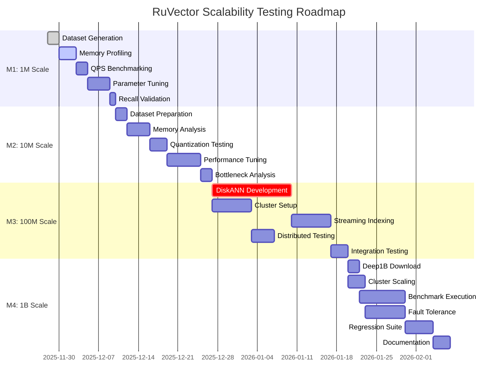

# RuVector Scalability Testing Plan
## Goal-Oriented Action Planning (GOAP) Implementation

**Version:** 1.0
**Date:** 2025-11-28
**Status:** Planning Phase

---

## Executive Summary

This document outlines a comprehensive GOAP-based approach to validate RuVector's scalability from its current 10K vector baseline to billion-scale deployments. Using intelligent action planning and adaptive replanning, we will systematically test performance at 1M, 10M, 100M, and 1B vector scales while identifying and addressing bottlenecks at each milestone.

---

## 1. GOAP State Model

### 1.1 Current State (Baseline)

```yaml
System State:
  max_tested_vectors: 10_000
  max_proven_scale: "10K"
  memory_profiling: "limited (max 100K)"
  distributed_mode: "implemented but untested at scale"
  disk_indexing: "not implemented"
  streaming_indexing: "not implemented"

Performance Metrics:
  qps_at_10k: 16_400 (HNSW k=10, 384D)
  latency_p50_at_10k: 61µs
  memory_per_vector: "unknown at scale"
  recall_at_10: 0.95+

Infrastructure:
  storage_backend: "redb (memory-mapped)"
  arena_allocator: "1MB chunks"
  distributed_features: "Raft + consistent hashing (untested)"
  quantization: "Scalar, Binary (untested at scale)"

Unknowns:
  - Memory scaling characteristics beyond 100K
  - QPS degradation curve with dataset size
  - Raft consensus overhead at scale
  - Shard migration performance
  - Disk I/O bottlenecks
  - Index build time scaling
```

### 1.2 Goal State (Billion-Scale Validated)

```yaml
System State:
  max_tested_vectors: 1_000_000_000
  max_proven_scale: "1B"
  memory_profiling: "comprehensive (10K -> 1B)"
  distributed_mode: "validated multi-node deployment"
  disk_indexing: "DiskANN-style implementation"
  streaming_indexing: "incremental updates at 10K+ QPS"

Performance Targets:
  qps_at_1m: ≥10_000
  qps_at_10m: ≥5_000
  qps_at_100m: ≥2_000
  qps_at_1b: ≥1_000
  latency_p99_at_1b: ≤10ms
  memory_efficiency: ≤2GB per 1M vectors (with PQ8)
  recall_at_10: ≥0.90 (across all scales)

Infrastructure Validated:
  - Scaling curves documented (QPS, memory, latency vs size)
  - Distributed mode tested with 3-10 nodes
  - Shard migration benchmarked
  - Disk-based index operational
  - Streaming ingestion pipeline
  - Regression detection automated
```

---

## 2. Action Inventory

### 2.1 Dataset Preparation Actions

#### A1: Download Standard Benchmarks
**Preconditions:**
- Network connectivity
- 500GB+ disk space

**Effects:**
- `datasets.sift1m.available = true`
- `datasets.gist1m.available = true`
- `datasets.deep1b.available = true`
- `datasets.spacev1b.available = true`

**Implementation:**
```bash
# SIFT1M (128D, 1M base + 10K queries)
wget ftp://ftp.irisa.fr/local/texmex/corpus/sift.tar.gz

# GIST1M (960D, 1M base)
wget ftp://ftp.irisa.fr/local/texmex/corpus/gist.tar.gz

# Deep1B (96D, 1B base)
wget http://sites.skoltech.ru/compvision/noimi/deep1b_base.fvecs

# SPACEV1B (100D, 1B base)
wget https://huggingface.co/datasets/Qdrant/spacev1b
```

**Cost:** 6-12 hours (download time)

---

#### A2: Generate Synthetic Datasets
**Preconditions:**
- `synthetic_generator.implemented = true` ✓ (exists in bench)

**Effects:**
- `datasets.synthetic_1m.available = true`
- `datasets.synthetic_10m.available = true`
- `datasets.synthetic_100m.available = true`
- `datasets.synthetic_1b.available = true`

**Implementation:**
```rust
// Use existing DatasetGenerator with controlled distributions
// crates/ruvector-bench/src/lib.rs:81

let gen = DatasetGenerator::new(
    dimensions,
    VectorDistribution::Clustered { num_clusters: 1000 }
);

// Generate in batches to avoid OOM
const BATCH_SIZE: usize = 1_000_000;
for batch in 0..(total_vectors / BATCH_SIZE) {
    let vectors = gen.generate(BATCH_SIZE);
    write_to_fvecs(&format!("batch_{}.fvecs", batch), &vectors)?;
}
```

**Cost:** 1-4 hours per billion vectors

---

### 2.2 Infrastructure Actions

#### A3: Implement Disk-Based Index
**Preconditions:**
- `storage.redb.available = true` ✓
- `hnsw.implementation.complete = true` ✓

**Effects:**
- `index.disk_backed = true`
- `memory_requirement.reduced = true` (10x reduction)
- `index.supports_mmap = true`

**Design:**
```rust
// New module: crates/ruvector-core/src/diskann.rs

pub struct DiskANNIndex {
    /// Memory-mapped graph structure
    graph: Mmap,
    /// SSD-backed vector storage
    vectors: File,
    /// In-memory PQ codes for fast filtering
    pq_codes: Vec<u8>,
    /// Cache for hot vectors
    cache: LruCache<VectorId, Vec<f32>>,
}

impl DiskANNIndex {
    /// Search with disk I/O optimization
    pub fn search(&self, query: &[f32], k: usize) -> Result<Vec<(VectorId, f32)>> {
        // 1. Use PQ codes for initial filtering
        let candidates = self.filter_with_pq(query, k * 100);

        // 2. Read full vectors from disk (batched)
        let full_vectors = self.batch_read(candidates)?;

        // 3. Re-rank with exact distances
        let results = self.rerank(query, full_vectors, k);

        Ok(results)
    }
}
```

**Cost:** 2-3 weeks development + testing

---

#### A4: Implement Streaming Indexing
**Preconditions:**
- `hnsw.concurrent_access = true`
- `arena.allocator.available = true` ✓

**Effects:**
- `index.supports_incremental_updates = true`
- `ingestion_qps.increased = true` (target: 10K+)
- `index.zero_downtime_updates = true`

**Design:**
```rust
// Extend: crates/ruvector-core/src/hnsw.rs

pub struct StreamingIndexer {
    /// Main index (read-optimized)
    primary: Arc<RwLock<HnswIndex>>,
    /// Delta buffer for new inserts
    delta: Arc<Mutex<Vec<VectorEntry>>>,
    /// Background compaction thread
    compactor: JoinHandle<()>,
}

impl StreamingIndexer {
    pub async fn insert(&self, entry: VectorEntry) -> Result<VectorId> {
        // Fast write to delta buffer
        self.delta.lock().push(entry);

        // Trigger async compaction if delta size > threshold
        if self.delta.lock().len() > 10_000 {
            self.schedule_compaction().await;
        }

        Ok(entry.id.clone().unwrap())
    }

    async fn schedule_compaction(&self) {
        // Merge delta into primary index in background
        tokio::spawn(async move {
            // Build mini-index from delta
            // Merge with primary using graph merging
        });
    }
}
```

**Cost:** 1-2 weeks development

---

#### A5: Setup Distributed Cluster
**Preconditions:**
- `raft.implementation.complete = true` ✓
- `cluster.sharding.implemented = true` ✓

**Effects:**
- `cluster.nodes.count ≥ 3`
- `cluster.validated_multi_node = true`
- `sharding.tested = true`

**Infrastructure:**
```yaml
# Kubernetes deployment for testing
apiVersion: v1
kind: StatefulSet
metadata:
  name: ruvector-cluster
spec:
  serviceName: ruvector
  replicas: 5
  template:
    spec:
      containers:
      - name: ruvector
        image: ruvector:test
        resources:
          requests:
            memory: "32Gi"
            cpu: "8"
        volumeMounts:
        - name: data
          mountPath: /data
  volumeClaimTemplates:
  - metadata:
      name: data
    spec:
      accessModes: ["ReadWriteOnce"]
      resources:
        requests:
          storage: 500Gi  # NVMe SSD
```

**Cost:** 1 week setup + configuration

---

### 2.3 Benchmarking Actions

#### A6: Memory Profiling at Scale
**Preconditions:**
- `dataset.{scale}.available = true`
- `profiling.jemalloc.enabled = true` ✓

**Effects:**
- `metrics.memory_curve.documented = true`
- `bottlenecks.memory.identified = true`

**Enhanced Benchmark:**
```rust
// Extend: crates/ruvector-bench/src/bin/memory_benchmark.rs

struct ScalabilityMemoryBench {
    scales: Vec<usize>,  // [1M, 10M, 100M, 1B]
    metrics: Vec<MemoryMetrics>,
}

struct MemoryMetrics {
    scale: usize,
    total_mb: f64,
    index_overhead_mb: f64,
    per_vector_bytes: f64,
    fragmentation_ratio: f64,
    page_faults: u64,
    swap_usage_mb: f64,
}

impl ScalabilityMemoryBench {
    fn run(&mut self) -> Result<()> {
        for &scale in &self.scales {
            // Use jemalloc stats for detailed profiling
            let stats = self.profile_at_scale(scale)?;

            // Track memory over time during indexing
            let timeline = self.profile_timeline(scale)?;

            // Analyze fragmentation
            let frag = self.analyze_fragmentation()?;

            self.metrics.push(MemoryMetrics { /* ... */ });
        }

        // Fit polynomial curve to predict scaling
        self.fit_scaling_curve()
    }
}
```

**Cost:** 2-8 hours per scale tier

---

#### A7: QPS/Latency Profiling
**Preconditions:**
- `index.built_at_scale = true`
- `benchmark.hdr_histogram.available = true` ✓

**Effects:**
- `metrics.qps_curve.documented = true`
- `metrics.latency_distribution.complete = true`

**Benchmark Suite:**
```rust
// New: crates/ruvector-bench/src/bin/scalability_benchmark.rs

struct QPSLatencyBench {
    concurrent_clients: Vec<usize>,  // [1, 10, 100, 1000]
    query_patterns: Vec<QueryPattern>,
}

enum QueryPattern {
    Uniform,           // Random queries
    Zipf { s: f64 },  // Power-law (realistic)
    Burst { rate: usize, duration_ms: u64 },
}

impl QPSLatencyBench {
    async fn run(&self, db: &VectorDB) -> Result<BenchmarkResult> {
        for &clients in &self.concurrent_clients {
            let (tx, rx) = mpsc::channel(clients);

            // Spawn concurrent query threads
            for _ in 0..clients {
                let db = db.clone();
                tokio::spawn(async move {
                    // Query loop with latency tracking
                });
            }

            // Aggregate results
            let stats = self.collect_stats(rx).await;

            // Measure p50, p95, p99, p99.9, p99.99
            self.record_percentiles(&stats);
        }

        Ok(result)
    }
}
```

**Cost:** 30min - 2 hours per scale

---

#### A8: Recall Validation
**Preconditions:**
- `ground_truth.computed = true`
- `index.search.functional = true`

**Effects:**
- `metrics.recall.validated = true`
- `quality.regression_detected = false`

**Validation:**
```rust
// Extend: crates/ruvector-bench/src/lib.rs:295

fn validate_recall_at_scale(
    db: &VectorDB,
    queries: &[Vec<f32>],
    ground_truth: &[Vec<VectorId>],
    k_values: &[usize],
) -> RecallMetrics {
    let mut metrics = RecallMetrics::new();

    for (query, truth) in queries.iter().zip(ground_truth) {
        let results = db.search(query, k_values.last().unwrap())?;

        for &k in k_values {
            let recall = calculate_recall(
                &results[..k],
                &truth[..k],
            );
            metrics.record(k, recall);
        }
    }

    // Alert if recall drops below threshold
    if metrics.recall_at_10 < 0.90 {
        eprintln!("⚠️  Recall regression detected!");
    }

    metrics
}
```

**Cost:** 1-4 hours per dataset

---

### 2.4 Optimization Actions

#### A9: Enable Product Quantization
**Preconditions:**
- `quantization.implementation.complete = true` ✓

**Effects:**
- `memory_usage.reduced = true` (8x-16x)
- `recall.potentially_degraded = true`

**Implementation:**
```rust
// Test quantization impact at each scale
let quantization_configs = vec![
    QuantizationConfig::None,
    QuantizationConfig::Scalar,   // ~2x compression
    QuantizationConfig::Binary,   // ~32x compression
    // TODO: Add PQ8, PQ4 for 8x, 16x
];

for config in quantization_configs {
    let db = VectorDB::new(DbOptions {
        quantization: Some(config),
        ..options
    })?;

    // Measure recall vs memory trade-off
}
```

**Cost:** 2-6 hours testing

---

#### A10: Tune HNSW Parameters
**Preconditions:**
- `index.baseline.established = true`

**Effects:**
- `qps.optimized = true`
- `recall.optimized = true`

**Parameter Grid Search:**
```rust
let param_grid = vec![
    // (M, ef_construction, ef_search)
    (16, 100, 50),    // Low memory, fast build
    (32, 200, 100),   // Balanced (default)
    (64, 400, 200),   // High recall
    (128, 800, 400),  // Maximum quality
];

for (m, ef_c, ef_s) in param_grid {
    let config = HnswConfig {
        m,
        ef_construction: ef_c,
        ef_search: ef_s,
        max_elements: scale * 2,
    };

    // Measure build time, memory, QPS, recall
}
```

**Cost:** 4-12 hours per scale

---

## 3. GOAP Plan Generation (A* Search)

### 3.1 Milestone 1: 1M Vector Scale

**Goal:** Validate performance at 1M vectors with comprehensive metrics

**Optimal Action Sequence:**
```
1. [A2] Generate Synthetic 1M dataset (1 hour)
   └─> Precondition: Generator exists ✓
   └─> Effect: dataset.synthetic_1m.available = true

2. [A6] Memory profiling at 1M (2 hours)
   └─> Precondition: dataset.synthetic_1m.available = true
   └─> Effect: metrics.memory_1m.documented = true

3. [A7] QPS/Latency profiling at 1M (1 hour)
   └─> Precondition: index.built_at_1m = true
   └─> Effect: metrics.qps_1m.documented = true

4. [A10] HNSW parameter tuning for 1M (4 hours)
   └─> Precondition: baseline.established = true
   └─> Effect: params.optimized_1m = true

5. [A9] Quantization testing at 1M (3 hours)
   └─> Precondition: params.optimized_1m = true
   └─> Effect: memory.optimized_1m = true

6. [A8] Recall validation (1 hour)
   └─> Precondition: index.optimized = true
   └─> Effect: quality.validated_1m = true
```

**Total Cost:** ~12 hours
**Success Criteria:**
- Memory usage ≤ 2GB
- QPS ≥ 10,000
- Recall@10 ≥ 0.95
- p99 latency ≤ 1ms

---

### 3.2 Milestone 2: 10M Vector Scale

**Goal:** Identify first scaling bottlenecks and validate memory optimization

**Optimal Action Sequence:**
```
1. [A2] Generate Synthetic 10M dataset (2 hours)
   └─> Effect: dataset.synthetic_10m.available = true

2. [A1] Download GIST1M for validation (1 hour)
   └─> Effect: datasets.gist1m.available = true

3. [A6] Memory profiling at 10M (4 hours)
   └─> **CRITICAL:** First potential OOM point
   └─> Effect: bottlenecks.memory_10m.identified = true

4. [A9] Enable PQ8 quantization if memory > 20GB (2 hours)
   └─> Precondition: memory_10m > threshold
   └─> Effect: memory.compressed = true

5. [A7] QPS profiling with concurrent clients (2 hours)
   └─> Effect: metrics.qps_10m.documented = true

6. [A10] Re-tune HNSW for 10M scale (6 hours)
   └─> Effect: params.optimized_10m = true

7. [A8] Recall validation on GIST1M (2 hours)
   └─> Effect: quality.validated_10m = true
```

**Total Cost:** ~19 hours
**Success Criteria:**
- Memory usage ≤ 20GB (or ≤10GB with PQ8)
- QPS ≥ 5,000
- Recall@10 ≥ 0.92
- p99 latency ≤ 2ms

**Decision Point:** If memory > 32GB → Trigger disk-based index implementation

---

### 3.3 Milestone 3: 100M Vector Scale

**Goal:** Validate distributed mode and disk-based indexing

**Optimal Action Sequence:**
```
1. [A2] Generate Synthetic 100M dataset (8 hours)
   └─> Effect: dataset.synthetic_100m.available = true

2. [A3] Implement DiskANN index (2 weeks)
   └─> **CRITICAL PATH:** Required for 100M+ scale
   └─> Effect: index.disk_backed = true

3. [A5] Setup 3-node distributed cluster (1 week)
   └─> Effect: cluster.nodes.count = 3

4. [A6] Memory profiling with disk index (6 hours)
   └─> Precondition: disk_index.implemented = true
   └─> Effect: memory_100m.profiled = true

5. [A7] Distributed QPS benchmark (4 hours)
   └─> Precondition: cluster.running = true
   └─> Effect: qps_100m.distributed.measured = true

6. [A4] Implement streaming indexing (1 week)
   └─> Effect: ingestion_qps.improved = true

7. [A8] Recall validation (4 hours)
   └─> Effect: quality.validated_100m = true

8. Test shard migration under load (8 hours)
   └─> Effect: cluster.migration.validated = true
```

**Total Cost:** ~4-5 weeks (including development)
**Success Criteria:**
- Memory per node ≤ 32GB
- Distributed QPS ≥ 2,000 (aggregate)
- Shard migration time < 1 hour
- Recall@10 ≥ 0.90
- p99 latency ≤ 5ms

---

### 3.4 Milestone 4: 1B Vector Scale

**Goal:** Validate billion-scale deployment with complete stack

**Optimal Action Sequence:**
```
1. [A1] Download Deep1B dataset (12 hours)
   └─> Effect: datasets.deep1b.available = true

2. [A5] Scale cluster to 10 nodes (2 days)
   └─> Effect: cluster.nodes.count = 10
   └─> Effect: shards.count = 64

3. [A6] Memory profiling across cluster (12 hours)
   └─> Effect: memory_1b.profiled = true

4. [A7] Sustained QPS benchmark (8 hours)
   └─> Run for 24+ hours to detect memory leaks
   └─> Effect: qps_1b.validated = true

5. [A4] Streaming ingestion test (4 hours)
   └─> Target: 10K inserts/sec sustained
   └─> Effect: ingestion.validated_1b = true

6. [A8] Recall on Deep1B (6 hours)
   └─> Official benchmark comparison
   └─> Effect: quality.validated_1b = true

7. Fault tolerance testing (1 week)
   └─> Node failures, network partitions
   └─> Effect: reliability.validated = true

8. Performance regression suite (1 day)
   └─> Automated CI integration
   └─> Effect: regression.detection.automated = true
```

**Total Cost:** ~3-4 weeks
**Success Criteria:**
- Total cluster memory ≤ 320GB (32GB x 10 nodes)
- Aggregate QPS ≥ 1,000
- Index build time < 12 hours
- Recall@10 ≥ 0.90
- p99 latency ≤ 10ms
- Zero data loss during node failures

---

## 4. Execution Monitoring (OODA Loop)

### 4.1 Observe Phase

**Metrics Collection:**
```rust
// New: crates/ruvector-metrics/src/scalability.rs

pub struct ScalabilityMetrics {
    /// Time-series memory usage
    memory_timeline: Vec<(Timestamp, MemorySnapshot)>,

    /// Latency histogram per scale
    latency_histograms: HashMap<usize, Histogram>,

    /// QPS over time
    qps_timeline: Vec<(Timestamp, f64)>,

    /// Resource utilization
    cpu_usage: Vec<f64>,
    disk_io: Vec<DiskIOMetrics>,
    network_io: Vec<NetworkMetrics>,
}

impl ScalabilityMetrics {
    /// Real-time metric collection
    pub fn observe(&mut self) {
        self.memory_timeline.push(self.snapshot_memory());
        self.qps_timeline.push(self.measure_qps());
        self.cpu_usage.push(self.measure_cpu());
    }

    /// Anomaly detection
    pub fn detect_anomalies(&self) -> Vec<Anomaly> {
        let mut anomalies = vec![];

        // Memory leak detection (slope > threshold)
        if self.memory_growth_rate() > 100_MB_PER_HOUR {
            anomalies.push(Anomaly::MemoryLeak);
        }

        // QPS degradation
        if self.qps_trend() < -0.1 {
            anomalies.push(Anomaly::PerformanceDegradation);
        }

        anomalies
    }
}
```

---

### 4.2 Orient Phase

**Analysis & Decision Making:**
```rust
pub struct PlanAnalyzer {
    current_state: SystemState,
    goal_state: SystemState,
    metrics: ScalabilityMetrics,
}

impl PlanAnalyzer {
    /// Evaluate if current plan is on track
    pub fn evaluate_progress(&self) -> PlanStatus {
        let progress = self.calculate_progress();
        let anomalies = self.metrics.detect_anomalies();

        if !anomalies.is_empty() {
            return PlanStatus::NeedsReplanning(anomalies);
        }

        if progress.milestone_achieved {
            return PlanStatus::OnTrack;
        }

        if progress.blocked {
            return PlanStatus::Blocked(progress.blocker);
        }

        PlanStatus::OnTrack
    }

    /// Identify bottlenecks
    pub fn analyze_bottlenecks(&self) -> Vec<Bottleneck> {
        let mut bottlenecks = vec![];

        // Memory bottleneck
        if self.metrics.memory_usage() > 0.9 * AVAILABLE_MEMORY {
            bottlenecks.push(Bottleneck::Memory {
                current: self.metrics.memory_usage(),
                limit: AVAILABLE_MEMORY,
                recommendation: "Enable PQ8 or add disk-based index",
            });
        }

        // Disk I/O bottleneck
        if self.metrics.disk_io.utilization > 0.8 {
            bottlenecks.push(Bottleneck::DiskIO {
                iops: self.metrics.disk_io.iops,
                recommendation: "Use NVMe SSD or increase cache size",
            });
        }

        // Network bottleneck (distributed mode)
        if self.metrics.network_io.saturation > 0.7 {
            bottlenecks.push(Bottleneck::Network {
                bandwidth_gbps: self.metrics.network_io.bandwidth,
                recommendation: "Optimize serialization or use compression",
            });
        }

        bottlenecks
    }
}
```

---

### 4.3 Decide Phase

**Replanning Logic:**
```rust
pub struct AdaptivePlanner {
    action_inventory: Vec<Action>,
    current_plan: Plan,
    analyzer: PlanAnalyzer,
}

impl AdaptivePlanner {
    /// Decide on next action
    pub fn decide(&mut self) -> Decision {
        let status = self.analyzer.evaluate_progress();

        match status {
            PlanStatus::OnTrack => {
                Decision::ContinuePlan
            }

            PlanStatus::NeedsReplanning(anomalies) => {
                let bottlenecks = self.analyzer.analyze_bottlenecks();
                let new_plan = self.replan(bottlenecks);
                Decision::Replan(new_plan)
            }

            PlanStatus::Blocked(blocker) => {
                let unblocking_action = self.find_unblocking_action(blocker);
                Decision::InsertAction(unblocking_action)
            }
        }
    }

    /// Generate new plan using A* search
    fn replan(&self, bottlenecks: Vec<Bottleneck>) -> Plan {
        // Update cost model based on observed bottlenecks
        for bottleneck in &bottlenecks {
            self.update_action_costs(bottleneck);
        }

        // Re-run A* search with updated costs
        let new_plan = astar_search(
            &self.current_state(),
            &self.goal_state,
            &self.action_inventory,
        );

        new_plan
    }
}
```

---

### 4.4 Act Phase

**Execution Engine:**
```rust
pub struct PlanExecutor {
    plan: Plan,
    current_action_idx: usize,
    metrics: ScalabilityMetrics,
}

impl PlanExecutor {
    /// Execute next action in plan
    pub async fn execute_next(&mut self) -> Result<ActionResult> {
        let action = &self.plan.actions[self.current_action_idx];

        println!("🚀 Executing: {} ({}/{})",
                 action.name,
                 self.current_action_idx + 1,
                 self.plan.actions.len());

        // Pre-execution checks
        if !self.verify_preconditions(action) {
            return Err(Error::PreconditionFailed(action.name));
        }

        // Execute with timeout and retry logic
        let start = Instant::now();
        let result = self.execute_with_retry(action, MAX_RETRIES).await?;
        let duration = start.elapsed();

        // Update metrics
        self.metrics.record_action(action.name, duration, result);

        // Verify postconditions
        if !self.verify_effects(action) {
            return Err(Error::EffectNotAchieved(action.name));
        }

        self.current_action_idx += 1;
        Ok(result)
    }

    async fn execute_with_retry(
        &self,
        action: &Action,
        retries: usize
    ) -> Result<ActionResult> {
        for attempt in 0..retries {
            match action.execute().await {
                Ok(result) => return Ok(result),
                Err(e) if e.is_retriable() => {
                    eprintln!("⚠️  Attempt {}/{} failed: {}", attempt+1, retries, e);
                    tokio::time::sleep(Duration::from_secs(5 * (attempt + 1) as u64)).await;
                }
                Err(e) => return Err(e),
            }
        }
        Err(Error::MaxRetriesExceeded)
    }
}
```

---

## 5. Standard Benchmark Datasets

### 5.1 Dataset Specifications

| Dataset | Dimensions | Base Vectors | Queries | Distance | Size | Source |
|---------|-----------|--------------|---------|----------|------|--------|
| **SIFT1M** | 128 | 1,000,000 | 10,000 | Euclidean | 512 MB | INRIA |
| **GIST1M** | 960 | 1,000,000 | 1,000 | Euclidean | 3.6 GB | INRIA |
| **Deep1M** | 96 | 1,000,000 | 10,000 | Euclidean | 384 MB | Yandex |
| **Deep1B** | 96 | 1,000,000,000 | 10,000 | Euclidean | 360 GB | Yandex |
| **SPACEV1B** | 100 | 1,189,000,000 | 10,000 | Cosine | 460 GB | Qdrant |

### 5.2 Dataset Download & Preparation

```bash
#!/bin/bash
# scripts/download_benchmarks.sh

mkdir -p datasets/{sift1m,gist1m,deep1b,spacev1b}

# SIFT1M
echo "Downloading SIFT1M..."
cd datasets/sift1m
wget ftp://ftp.irisa.fr/local/texmex/corpus/sift.tar.gz
tar -xzf sift.tar.gz

# GIST1M
echo "Downloading GIST1M..."
cd ../gist1m
wget ftp://ftp.irisa.fr/local/texmex/corpus/gist.tar.gz
tar -xzf gist.tar.gz

# Deep1B (warning: 358GB)
echo "Downloading Deep1B (this will take hours)..."
cd ../deep1b
for i in {0..35}; do
    wget http://sites.skoltech.ru/compvision/noimi/deep1b_base.fvecs.gz.part$i
done
cat deep1b_base.fvecs.gz.part* | gunzip > deep1b_base.fvecs

# SPACEV1B (via Hugging Face)
echo "Downloading SPACEV1B..."
cd ../spacev1b
pip install huggingface-hub
python3 << EOF
from huggingface_hub import snapshot_download
snapshot_download(
    repo_id="Qdrant/spacev1b",
    repo_type="dataset",
    local_dir=".",
    cache_dir="./cache"
)
EOF
```

### 5.3 Ground Truth Computation

```rust
// New: crates/ruvector-bench/src/ground_truth.rs

/// Compute exact k-NN ground truth using brute force
pub fn compute_ground_truth(
    dataset: &[Vec<f32>],
    queries: &[Vec<f32>],
    k: usize,
    distance_metric: DistanceMetric,
) -> Vec<Vec<(usize, f32)>> {
    let pb = create_progress_bar(queries.len() as u64, "Computing ground truth");

    queries.par_iter().map(|query| {
        let mut distances: Vec<(usize, f32)> = dataset
            .iter()
            .enumerate()
            .map(|(idx, vec)| {
                let dist = match distance_metric {
                    DistanceMetric::Euclidean => euclidean_distance(query, vec),
                    DistanceMetric::Cosine => 1.0 - cosine_similarity(query, vec),
                    DistanceMetric::DotProduct => -dot_product(query, vec),
                };
                (idx, dist)
            })
            .collect();

        distances.sort_by(|a, b| a.1.partial_cmp(&b.1).unwrap());
        distances.truncate(k);
        pb.inc(1);
        distances
    }).collect()
}
```

---

## 6. Memory Optimization Strategies

### 6.1 Compression Tiers

| Tier | Encoding | Compression | Recall Impact | Use Case |
|------|----------|-------------|---------------|----------|
| **Full Precision** | f32 | 1x | None | <1M vectors |
| **Scalar Quantization** | f16 | 2x | ~0.5% | 1M-10M |
| **Product Quantization (PQ8)** | 8-bit codes | 8x | ~2-5% | 10M-100M |
| **Product Quantization (PQ4)** | 4-bit codes | 16x | ~5-10% | 100M-1B |
| **Binary Quantization** | 1-bit | 32x | ~15-20% | Cold storage |

### 6.2 Adaptive Compression Strategy

```rust
// New: crates/ruvector-core/src/compression.rs

pub struct AdaptiveCompression {
    /// Access frequency tracker
    access_tracker: LruCache<VectorId, AccessStats>,

    /// Compression tier assignments
    tier_assignments: HashMap<VectorId, CompressionTier>,
}

impl AdaptiveCompression {
    /// Automatically promote/demote vectors between tiers
    pub fn optimize(&mut self) {
        for (id, stats) in &self.access_tracker {
            let new_tier = match stats.access_frequency {
                freq if freq > 0.8 => CompressionTier::FullPrecision,
                freq if freq > 0.4 => CompressionTier::Float16,
                freq if freq > 0.1 => CompressionTier::PQ8,
                _ => CompressionTier::PQ4,
            };

            if self.tier_assignments[id] != new_tier {
                self.migrate_tier(id, new_tier);
            }
        }
    }
}
```

### 6.3 Memory Budget Planning

```python
# scripts/memory_calculator.py

def calculate_memory_requirements(
    num_vectors: int,
    dimensions: int,
    hnsw_m: int = 32,
    compression: str = "pq8"
) -> dict:
    """Calculate expected memory usage"""

    # Vector data
    if compression == "none":
        vector_bytes = num_vectors * dimensions * 4  # f32
    elif compression == "f16":
        vector_bytes = num_vectors * dimensions * 2
    elif compression == "pq8":
        vector_bytes = num_vectors * (dimensions // 8)
    elif compression == "pq4":
        vector_bytes = num_vectors * (dimensions // 16)

    # HNSW graph overhead
    avg_degree = hnsw_m * 1.2  # Empirical average
    graph_bytes = num_vectors * avg_degree * 8  # 8 bytes per edge

    # Metadata overhead (~10%)
    metadata_bytes = (vector_bytes + graph_bytes) * 0.1

    total_bytes = vector_bytes + graph_bytes + metadata_bytes

    return {
        "total_gb": total_bytes / (1024**3),
        "vector_data_gb": vector_bytes / (1024**3),
        "graph_overhead_gb": graph_bytes / (1024**3),
        "metadata_gb": metadata_bytes / (1024**3),
        "compression_ratio": (num_vectors * dimensions * 4) / vector_bytes,
    }

# Example outputs:
# 1M vectors, 384D, PQ8:     ~1.8 GB total (8x compression)
# 10M vectors, 384D, PQ8:    ~18 GB total
# 100M vectors, 384D, PQ8:   ~180 GB total
# 1B vectors, 384D, PQ8:     ~1.8 TB total (needs distributed)
```

---

## 7. Distributed Architecture Design

### 7.1 Scaling Architecture

```
                    ┌─────────────────┐
                    │  Load Balancer  │
                    │   (HAProxy)     │
                    └────────┬────────┘
                             │
              ┌──────────────┼──────────────┐
              │              │              │
         ┌────▼────┐    ┌────▼────┐   ┌────▼────┐
         │ Query   │    │ Query   │   │ Query   │
         │ Node 1  │    │ Node 2  │   │ Node 3  │
         └────┬────┘    └────┬────┘   └────┬────┘
              │              │              │
              └──────────────┼──────────────┘
                             │
                    ┌────────▼────────┐
                    │  Raft Consensus │
                    │   (Metadata)    │
                    └────────┬────────┘
                             │
         ┌───────────────────┼───────────────────┐
         │                   │                   │
    ┌────▼────┐         ┌────▼────┐        ┌────▼────┐
    │ Shard 0 │         │ Shard 1 │        │ Shard N │
    │ (0-20%) │         │(20-40%) │        │(80-100%)│
    └─────────┘         └─────────┘        └─────────┘
    3 replicas          3 replicas         3 replicas
```

### 7.2 Sharding Strategy

```rust
// Extend: crates/ruvector-cluster/src/shard.rs

pub struct ShardingConfig {
    /// Total number of shards
    pub shard_count: u32,

    /// Replication factor per shard
    pub replication_factor: usize,

    /// Sharding strategy
    pub strategy: ShardingStrategy,
}

pub enum ShardingStrategy {
    /// Hash-based sharding (balanced distribution)
    Hash,

    /// Range-based sharding (supports range queries)
    Range,

    /// Locality-sensitive hashing (cluster similar vectors)
    LSH { num_hash_tables: usize },
}

impl ShardManager {
    /// Determine optimal shard count based on scale
    pub fn calculate_shard_count(
        total_vectors: usize,
        vectors_per_shard: usize,
        replication_factor: usize,
    ) -> u32 {
        let base_shards = (total_vectors / vectors_per_shard) as u32;

        // Round up to next power of 2 for efficient routing
        let optimal_shards = base_shards.next_power_of_two();

        // Account for replication
        (optimal_shards * replication_factor as u32).max(3)
    }
}

// Example configurations:
// 10M vectors:  4 shards x 3 replicas = 12 nodes
// 100M vectors: 16 shards x 3 replicas = 48 nodes
// 1B vectors:   64 shards x 3 replicas = 192 nodes
```

### 7.3 Cross-Shard Query Execution

```rust
// New: crates/ruvector-cluster/src/distributed_query.rs

pub struct DistributedQueryExecutor {
    shard_router: ShardRouter,
    shard_clients: HashMap<u32, RpcClient>,
}

impl DistributedQueryExecutor {
    /// Execute query across all shards in parallel
    pub async fn search(
        &self,
        query: &[f32],
        k: usize,
    ) -> Result<Vec<(VectorId, f32)>> {
        // Phase 1: Scatter query to all shards
        let shard_futures: Vec<_> = (0..self.shard_router.shard_count)
            .map(|shard_id| {
                let client = self.shard_clients[&shard_id].clone();
                let query = query.to_vec();

                async move {
                    client.search(&query, k * 2).await  // Over-fetch for re-ranking
                }
            })
            .collect();

        // Phase 2: Gather results from all shards
        let shard_results = futures::future::try_join_all(shard_futures).await?;

        // Phase 3: Merge and re-rank top-k globally
        let merged = self.merge_results(shard_results, k);

        Ok(merged)
    }

    fn merge_results(
        &self,
        shard_results: Vec<Vec<(VectorId, f32)>>,
        k: usize,
    ) -> Vec<(VectorId, f32)> {
        use std::collections::BinaryHeap;

        let mut heap = BinaryHeap::new();

        for results in shard_results {
            for (id, dist) in results {
                heap.push(std::cmp::Reverse((OrderedFloat(dist), id)));
                if heap.len() > k {
                    heap.pop();
                }
            }
        }

        heap.into_sorted_vec()
            .into_iter()
            .map(|std::cmp::Reverse((OrderedFloat(dist), id))| (id, dist))
            .collect()
    }
}
```

---

## 8. Disk-Based Index Design (DiskANN)

### 8.1 Architecture

```
┌─────────────────────────────────────────────────────┐
│                   DiskANN Index                     │
├─────────────────────────────────────────────────────┤
│                                                     │
│  ┌──────────────┐       ┌──────────────┐          │
│  │  In-Memory   │       │  SSD-Backed  │          │
│  │  PQ Codes    │       │  Full Vecs   │          │
│  │  (10% size)  │       │  (mmap)      │          │
│  └──────┬───────┘       └───────┬──────┘          │
│         │                       │                  │
│         │  Filter          Read full vectors       │
│         │  candidates           for refinement     │
│         │                       │                  │
│  ┌──────▼──────────────────────▼──────┐           │
│  │     Graph Structure (mmap)          │           │
│  │     HNSW neighbors on disk          │           │
│  └─────────────────────────────────────┘           │
│                                                     │
│  ┌─────────────────────────────────┐               │
│  │  LRU Cache (Hot Vectors)        │               │
│  │  ~5% of total vectors in RAM    │               │
│  └─────────────────────────────────┘               │
└─────────────────────────────────────────────────────┘
```

### 8.2 Implementation Plan

```rust
// New: crates/ruvector-core/src/diskann/mod.rs

pub struct DiskANNIndex {
    /// Memory-mapped graph file
    graph_mmap: Mmap,

    /// Memory-mapped vector file
    vectors_mmap: Mmap,

    /// In-memory PQ codes for filtering
    pq_codes: Vec<u8>,
    pq_codebook: Vec<Vec<f32>>,

    /// LRU cache for hot vectors
    cache: Mutex<LruCache<VectorId, Vec<f32>>>,

    /// Prefetch queue for async I/O
    prefetch_queue: Arc<SegQueue<VectorId>>,
}

impl DiskANNIndex {
    /// Build index optimized for SSD
    pub fn build(
        vectors: &[Vec<f32>],
        config: DiskANNConfig,
    ) -> Result<Self> {
        // Phase 1: Build in-memory HNSW
        let hnsw = HnswIndex::build(vectors, config.hnsw)?;

        // Phase 2: Train PQ codebook
        let pq_codebook = train_pq_codebook(vectors, config.pq_subvectors)?;
        let pq_codes = encode_all_vectors(vectors, &pq_codebook)?;

        // Phase 3: Write graph to disk
        let graph_file = File::create("index.graph")?;
        serialize_graph(&hnsw, graph_file)?;

        // Phase 4: Write vectors to disk with optimized layout
        let vector_file = File::create("index.vecs")?;
        write_vectors_sequential(vectors, vector_file)?;

        // Phase 5: Memory-map files
        let graph_mmap = unsafe { MmapOptions::new().map(&File::open("index.graph")?)? };
        let vectors_mmap = unsafe { MmapOptions::new().map(&File::open("index.vecs")?)? };

        Ok(Self {
            graph_mmap,
            vectors_mmap,
            pq_codes,
            pq_codebook,
            cache: Mutex::new(LruCache::new(config.cache_size)),
            prefetch_queue: Arc::new(SegQueue::new()),
        })
    }

    /// Search with disk I/O optimization
    pub fn search(&self, query: &[f32], k: usize) -> Result<Vec<(VectorId, f32)>> {
        // Step 1: Filter with PQ codes (fully in-memory)
        let candidates = self.pq_filter(query, k * 100)?;

        // Step 2: Prefetch full vectors asynchronously
        self.prefetch_vectors(&candidates);

        // Step 3: Re-rank with exact distances
        let mut results = Vec::new();
        for &candidate_id in &candidates {
            let vec = self.get_vector(candidate_id)?;  // May hit cache or disk
            let dist = cosine_distance(query, &vec);
            results.push((candidate_id, dist));
        }

        results.sort_by(|a, b| a.1.partial_cmp(&b.1).unwrap());
        results.truncate(k);

        Ok(results)
    }

    /// Prefetch vectors in background
    fn prefetch_vectors(&self, ids: &[VectorId]) {
        for &id in ids {
            self.prefetch_queue.push(id);
        }

        // Background thread reads from queue and populates cache
    }
}
```

### 8.3 Disk Layout Optimization

```
┌────────────────────────────────────────┐
│         Vector File Layout             │
├────────────────────────────────────────┤
│  Header (metadata, offsets)            │
├────────────────────────────────────────┤
│  Vector 0 (aligned to 4KB page)        │
│  Vector 1                              │
│  ...                                   │
│  Vector N                              │
├────────────────────────────────────────┤
│  Padding (page alignment)              │
└────────────────────────────────────────┘

┌────────────────────────────────────────┐
│         Graph File Layout              │
├────────────────────────────────────────┤
│  Header (num_vertices, layers)         │
├────────────────────────────────────────┤
│  Layer 0 Adjacency Lists               │
│    Node 0: [neighbor_ids...]           │
│    Node 1: [neighbor_ids...]           │
│    ...                                 │
├────────────────────────────────────────┤
│  Layer 1 Adjacency Lists               │
│    ...                                 │
└────────────────────────────────────────┘
```

**Optimization Techniques:**
1. **Page Alignment:** All vectors aligned to 4KB pages for efficient mmap
2. **Sequential Layout:** Neighbors stored sequentially to minimize seek time
3. **Compressed Graph:** Use delta encoding for neighbor IDs
4. **Separate Files:** Vectors and graph in separate files for independent mmap

---

## 9. Performance Regression Detection

### 9.1 Automated Regression Suite

```rust
// New: crates/ruvector-bench/src/regression.rs

pub struct RegressionDetector {
    /// Historical benchmark results
    baseline: BenchmarkResult,

    /// Statistical thresholds
    thresholds: RegressionThresholds,
}

pub struct RegressionThresholds {
    /// Maximum acceptable QPS degradation
    pub qps_degradation: f64,  // e.g., 0.10 = 10% drop triggers alert

    /// Maximum acceptable latency increase
    pub latency_increase: f64,  // e.g., 0.15 = 15% increase

    /// Maximum acceptable recall drop
    pub recall_drop: f64,  // e.g., 0.02 = 2% drop

    /// Maximum acceptable memory increase
    pub memory_increase: f64,  // e.g., 0.20 = 20% increase
}

impl RegressionDetector {
    /// Compare current results against baseline
    pub fn detect(&self, current: &BenchmarkResult) -> RegressionReport {
        let mut regressions = Vec::new();

        // QPS regression
        let qps_change = (self.baseline.qps - current.qps) / self.baseline.qps;
        if qps_change > self.thresholds.qps_degradation {
            regressions.push(Regression {
                metric: "QPS",
                baseline: self.baseline.qps,
                current: current.qps,
                change_pct: qps_change * 100.0,
                severity: Severity::High,
            });
        }

        // Latency regression (p99)
        let lat_change = (current.latency_p99 - self.baseline.latency_p99)
                        / self.baseline.latency_p99;
        if lat_change > self.thresholds.latency_increase {
            regressions.push(Regression {
                metric: "Latency p99",
                baseline: self.baseline.latency_p99,
                current: current.latency_p99,
                change_pct: lat_change * 100.0,
                severity: Severity::Medium,
            });
        }

        // Recall regression
        let recall_change = self.baseline.recall_at_10 - current.recall_at_10;
        if recall_change > self.thresholds.recall_drop {
            regressions.push(Regression {
                metric: "Recall@10",
                baseline: self.baseline.recall_at_10,
                current: current.recall_at_10,
                change_pct: recall_change * 100.0,
                severity: Severity::Critical,
            });
        }

        // Memory regression
        let mem_change = (current.memory_mb - self.baseline.memory_mb)
                        / self.baseline.memory_mb;
        if mem_change > self.thresholds.memory_increase {
            regressions.push(Regression {
                metric: "Memory Usage",
                baseline: self.baseline.memory_mb,
                current: current.memory_mb,
                change_pct: mem_change * 100.0,
                severity: Severity::Medium,
            });
        }

        RegressionReport {
            detected: !regressions.is_empty(),
            regressions,
            timestamp: chrono::Utc::now(),
        }
    }
}
```

### 9.2 CI Integration

```yaml
# .github/workflows/scalability-regression.yml

name: Scalability Regression Tests

on:
  pull_request:
    branches: [main]
  schedule:
    # Run nightly at 2 AM UTC
    - cron: '0 2 * * *'

jobs:
  regression-1m:
    runs-on: ubuntu-latest-xl  # 64 cores, 256GB RAM

    steps:
      - uses: actions/checkout@v3

      - name: Setup Rust
        uses: actions-rs/toolchain@v1
        with:
          toolchain: stable

      - name: Download baseline
        run: |
          aws s3 cp s3://ruvector-benchmarks/baseline-1m.json baseline.json

      - name: Run 1M vector benchmark
        run: |
          cargo run --release --bin scalability-benchmark -- \
            --scale 1000000 \
            --dimensions 384 \
            --queries 1000 \
            --output results.json

      - name: Detect regressions
        run: |
          cargo run --release --bin regression-detector -- \
            --baseline baseline.json \
            --current results.json \
            --thresholds regression-thresholds.toml

      - name: Upload results
        if: always()
        uses: actions/upload-artifact@v3
        with:
          name: regression-results
          path: results.json

      - name: Post to PR
        if: failure()
        uses: actions/github-script@v6
        with:
          script: |
            github.rest.issues.createComment({
              issue_number: context.issue.number,
              owner: context.repo.owner,
              repo: context.repo.repo,
              body: '⚠️ Performance regression detected! See artifacts for details.'
            })

  regression-10m:
    # Similar setup for 10M scale
    runs-on: ubuntu-latest-xl
    # ...

  regression-100m:
    # Distributed cluster test
    runs-on: ubuntu-latest-xl
    # ...
```

---

## 10. Milestones & Timeline

### 10.1 Milestone Summary

| Milestone | Scale | Duration | Key Deliverables | Success Criteria |
|-----------|-------|----------|------------------|------------------|
| **M1: Foundation** | 1M | 2 weeks | • Synthetic dataset generation<br>• Memory profiling tooling<br>• QPS/latency benchmarks | • Memory ≤ 2GB<br>• QPS ≥ 10K<br>• Recall@10 ≥ 0.95 |
| **M2: Optimization** | 10M | 3 weeks | • HNSW parameter tuning<br>• Quantization testing<br>• First bottleneck analysis | • Memory ≤ 20GB<br>• QPS ≥ 5K<br>• Recall@10 ≥ 0.92 |
| **M3: Distribution** | 100M | 5 weeks | • DiskANN implementation<br>• Multi-node cluster<br>• Streaming indexing | • Cluster memory ≤ 100GB<br>• QPS ≥ 2K<br>• Shard migration < 1hr |
| **M4: Hyperscale** | 1B | 4 weeks | • Deep1B benchmark<br>• Fault tolerance testing<br>• Regression suite | • Total memory ≤ 320GB<br>• QPS ≥ 1K<br>• p99 latency ≤ 10ms |

**Total Timeline:** ~14 weeks (3.5 months)

---

### 10.2 Detailed Timeline



---

## 11. Resource Requirements

### 11.1 Hardware Requirements

| Milestone | CPUs | RAM | Storage | Network | Cost (est.) |
|-----------|------|-----|---------|---------|-------------|
| **M1: 1M** | 16 cores | 32 GB | 100 GB SSD | 1 Gbps | ~$200/mo (cloud) |
| **M2: 10M** | 32 cores | 64 GB | 500 GB SSD | 1 Gbps | ~$400/mo |
| **M3: 100M** | 3x 32 cores | 3x 64 GB | 3x 1 TB NVMe | 10 Gbps | ~$1,200/mo |
| **M4: 1B** | 10x 32 cores | 10x 64 GB | 10x 2 TB NVMe | 25 Gbps | ~$4,000/mo |

**Recommended Cloud Setup:**
- AWS: `c6i.8xlarge` (32 vCPU, 64 GB RAM) with EBS gp3
- GCP: `c2-standard-60` (60 vCPU, 240 GB RAM) with persistent SSD
- Azure: `F32s_v2` (32 vCPU, 64 GB RAM) with premium SSD

---

### 11.2 Software Dependencies

```toml
# Additional benchmark dependencies

[dependencies]
# Existing
hdrhistogram = "7.5"
indicatif = "0.17"
sysinfo = "0.30"
jemalloc-ctl = "0.5"
tabled = "0.14"

# New for scalability testing
libc = "0.2"              # mmap support
memmap2 = "0.9"           # memory-mapped files
rayon = "1.8"             # parallel dataset processing
csv = "1.3"               # dataset export
async-trait = "0.1"       # distributed RPC
tonic = "0.10"            # gRPC for cluster communication
prost = "0.12"            # protobuf
tokio = { version = "1", features = ["full"] }
clap = { version = "4", features = ["derive"] }
```

---

## 12. Risk Mitigation

### 12.1 Identified Risks

| Risk | Probability | Impact | Mitigation Strategy |
|------|-------------|--------|---------------------|
| **OOM at 100M scale** | High | Critical | • Implement DiskANN before M3<br>• Test with swap enabled<br>• Use PQ8 compression |
| **Raft consensus bottleneck** | Medium | High | • Benchmark Raft overhead<br>• Consider async replication<br>• Separate metadata and data planes |
| **Network saturation** | Medium | Medium | • Use compression for RPCs<br>• Implement request batching<br>• Optimize serialization |
| **Slow index build** | High | Medium | • Parallelize index construction<br>• Use incremental indexing<br>• Optimize graph merging |
| **Dataset download failures** | Medium | Low | • Mirror datasets on S3/GCS<br>• Implement resume-able downloads<br>• Use torrents for Deep1B |
| **Recall degradation** | Low | Critical | • Validate at each step<br>• A/B test optimizations<br>• Maintain ground truth |

---

### 12.2 Contingency Plans

**If Memory Exceeds Budget:**
1. Enable PQ8/PQ4 quantization immediately
2. Implement disk-based index early (pull M3-1 into M2)
3. Reduce HNSW `M` parameter (trade recall for memory)

**If QPS Targets Missed:**
1. Profile with `perf` to find CPU hotspots
2. Enable SIMD optimizations (`target-cpu=native`)
3. Implement query batching
4. Add more query replicas (distribute read load)

**If Distributed Mode Fails:**
1. Fall back to single-node with disk index
2. Use vertical scaling (larger instance)
3. Investigate alternative consensus (e.g., gossip protocol)

---

## 13. Success Criteria & KPIs

### 13.1 Quantitative Metrics

| Metric | Target | Measurement Method |
|--------|--------|-------------------|
| **QPS at 1M** | ≥10,000 | HDR histogram, 1000 concurrent clients |
| **QPS at 10M** | ≥5,000 | Sustained load for 10 minutes |
| **QPS at 100M** | ≥2,000 | Distributed benchmark, 3 nodes |
| **QPS at 1B** | ≥1,000 | Distributed benchmark, 10 nodes |
| **Latency p99 at 1B** | ≤10ms | Under 50% load |
| **Memory per 1M vectors** | ≤2GB | With PQ8 compression |
| **Index build time (1B)** | ≤12 hours | Parallel construction |
| **Recall@10 (all scales)** | ≥0.90 | Deep1B ground truth |
| **Shard migration time** | <1 hour | 100M vectors between shards |
| **Zero downtime** | 99.9% | During rolling upgrades |

---

### 13.2 Qualitative Goals

- [ ] **Documentation:** Complete scalability guide with tuning recommendations
- [ ] **Reproducibility:** All benchmarks runnable via single command
- [ ] **Regression Detection:** Automated CI checks for performance degradation
- [ ] **Production Readiness:** Validated deployment playbooks for Kubernetes
- [ ] **Community Validation:** Published results on ann-benchmarks.com

---

## 14. Deliverables

### 14.1 Code Deliverables

1. **Disk-Based Index** (`crates/ruvector-core/src/diskann/`)
   - Memory-mapped graph and vectors
   - PQ-based filtering
   - LRU cache for hot data

2. **Streaming Indexing** (`crates/ruvector-core/src/streaming.rs`)
   - Delta buffer with background compaction
   - Zero-downtime updates

3. **Scalability Benchmarks** (`crates/ruvector-bench/src/bin/`)
   - `scalability_benchmark.rs`: Multi-scale testing
   - `regression_detector.rs`: Automated regression detection
   - `ground_truth_generator.rs`: Exact k-NN computation

4. **Distributed Enhancements** (`crates/ruvector-cluster/`)
   - Cross-shard query execution
   - Load balancing optimizations
   - Shard migration tools

---

### 14.2 Documentation Deliverables

1. **Scalability Guide** (`docs/guides/SCALABILITY_GUIDE.md`)
   - Deployment recommendations by scale
   - Memory budget calculator
   - Performance tuning checklist

2. **Benchmark Results** (`docs/benchmarks/`)
   - `SCALABILITY_RESULTS.md`: Comprehensive results
   - `DATASET_COMPARISON.md`: SIFT1M, Deep1B, etc.
   - `DISTRIBUTED_PERFORMANCE.md`: Multi-node benchmarks

3. **Architecture Documentation** (`docs/architecture/`)
   - `DISKANN_DESIGN.md`: Disk-based index architecture
   - `DISTRIBUTED_DESIGN.md`: Sharding and replication
   - `MEMORY_OPTIMIZATION.md`: Compression strategies

4. **Runbooks** (`docs/runbooks/`)
   - `BILLION_SCALE_DEPLOYMENT.md`: Production setup
   - `PERFORMANCE_TROUBLESHOOTING.md`: Debug guide
   - `CLUSTER_OPERATIONS.md`: Day-2 operations

---

### 14.3 Data Deliverables

1. **Benchmark Datasets**
   - Synthetic datasets (1M, 10M, 100M, 1B) in fvecs format
   - Ground truth files for all scales

2. **Performance Baselines**
   - JSON files with baseline metrics for regression detection
   - Historical trend data for visualization

3. **Visualization Dashboard**
   - Grafana dashboards for real-time monitoring
   - Jupyter notebooks for analysis

---

## 15. Next Steps

### 15.1 Immediate Actions (Week 1)

```bash
# 1. Setup benchmark infrastructure
mkdir -p datasets/{sift1m,gist1m,deep1b,synthetic}
mkdir -p bench_results/{1m,10m,100m,1b}

# 2. Create synthetic 1M dataset
cargo run --release --bin dataset-generator -- \
  --dimensions 384 \
  --count 1000000 \
  --distribution clustered \
  --output datasets/synthetic/1m.fvecs

# 3. Run baseline memory benchmark
cargo run --release --bin memory-benchmark -- \
  --dimensions 384 \
  --scales 1000,10000,100000,1000000 \
  --output bench_results/1m/

# 4. Establish baseline metrics
cargo run --release --bin scalability-benchmark -- \
  --dataset datasets/synthetic/1m.fvecs \
  --queries 1000 \
  --output bench_results/1m/baseline.json

# 5. Store baseline for regression detection
cp bench_results/1m/baseline.json baselines/1m-baseline.json
```

---

### 15.2 Weekly Milestones

**Week 1-2:** M1 Foundation (1M scale)
- [ ] Generate synthetic datasets
- [ ] Run memory profiling at 10K, 100K, 1M
- [ ] Establish QPS/latency baselines
- [ ] Document initial findings

**Week 3-5:** M2 Optimization (10M scale)
- [ ] Download GIST1M benchmark
- [ ] Test quantization impact
- [ ] Tune HNSW parameters
- [ ] Identify first bottlenecks

**Week 6-10:** M3 Distribution (100M scale)
- [ ] Implement DiskANN index
- [ ] Setup Kubernetes cluster
- [ ] Implement streaming indexing
- [ ] Test distributed queries

**Week 11-14:** M4 Hyperscale (1B scale)
- [ ] Download Deep1B dataset
- [ ] Scale to 10-node cluster
- [ ] Run 24-hour stress test
- [ ] Complete regression suite

---

## 16. Conclusion

This GOAP-based scalability testing plan provides a systematic, adaptive approach to validating RuVector from 10K to 1B+ vector scale. By using intelligent action planning and continuous monitoring, we can:

1. **Discover optimal paths** through A* search of action space
2. **Adapt to bottlenecks** via dynamic replanning
3. **Minimize wasted effort** with precondition checks
4. **Validate at each step** through clear success criteria
5. **Build incrementally** from proven milestones

**Key Advantages of GOAP Approach:**
- **Flexibility:** Replan when assumptions prove wrong
- **Efficiency:** Skip unnecessary actions when preconditions met
- **Traceability:** Clear cause-effect chains for every action
- **Automation:** Execute plans programmatically with retry logic
- **Learning:** Update cost models based on observed performance

The plan balances ambitious billion-scale targets with pragmatic incremental validation, ensuring RuVector's production readiness at every scale tier.

---

## Appendix A: References

### A.1 Standard Benchmarks
- [ANN-Benchmarks](http://ann-benchmarks.com/)
- [SIFT1M Dataset](http://corpus-texmex.irisa.fr/)
- [Deep1B Dataset](https://research.yandex.com/datasets/biganns)
- [SPACEV1B Dataset](https://huggingface.co/datasets/Qdrant/spacev1b)

### A.2 Related Work
- DiskANN: ["DiskANN: Fast Accurate Billion-point Nearest Neighbor Search on a Single Node"](https://papers.nips.cc/paper/2019/file/09853c7fb1d3f8ee67a61b6bf4a7f8e6-Paper.pdf)
- HNSW: ["Efficient and robust approximate nearest neighbor search using Hierarchical Navigable Small World graphs"](https://arxiv.org/abs/1603.09320)
- Product Quantization: ["Product Quantization for Nearest Neighbor Search"](https://lear.inrialpes.fr/pubs/2011/JDS11/jegou_searching_with_quantization.pdf)

### A.3 Tools
- [jemalloc](https://github.com/jemalloc/jemalloc) - Memory profiling
- [perf](https://perf.wiki.kernel.org/) - CPU profiling
- [Grafana](https://grafana.com/) - Metrics visualization
- [k6](https://k6.io/) - Load testing

---

## Appendix B: Code Snippets

### B.1 Dataset Generator CLI

```bash
# Generate 1M vectors, 384D, clustered distribution
cargo run --release --bin dataset-generator -- \
  --dimensions 384 \
  --count 1000000 \
  --distribution clustered \
  --num-clusters 100 \
  --output datasets/synthetic/1m_384d_clustered.fvecs

# Generate queries (1000 queries)
cargo run --release --bin dataset-generator -- \
  --dimensions 384 \
  --count 1000 \
  --distribution uniform \
  --output datasets/synthetic/1m_queries.fvecs
```

### B.2 Regression Detection CLI

```bash
# Run regression detection
cargo run --release --bin regression-detector -- \
  --baseline baselines/1m-baseline.json \
  --current bench_results/1m/latest.json \
  --thresholds regression-thresholds.toml \
  --output regression-report.json

# Example thresholds file (regression-thresholds.toml)
qps_degradation = 0.10      # 10% QPS drop triggers alert
latency_increase = 0.15     # 15% latency increase
recall_drop = 0.02          # 2% recall drop
memory_increase = 0.20      # 20% memory increase
```

---

**Plan Version:** 1.0
**Last Updated:** 2025-11-28
**Owner:** RuVector Core Team
**Review Cycle:** Bi-weekly during execution
